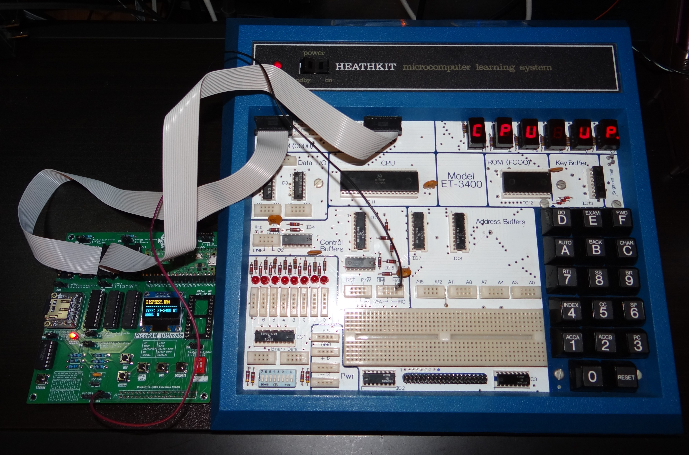
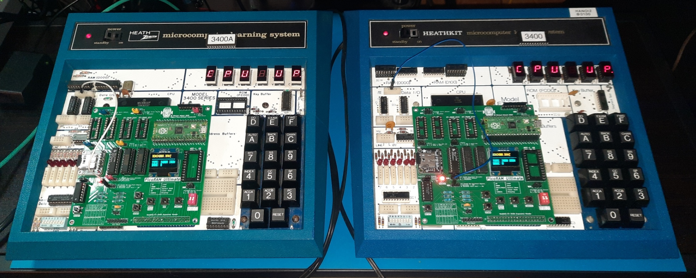
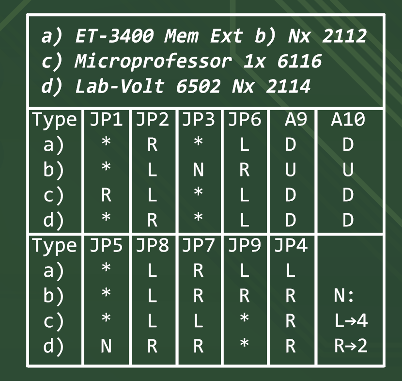
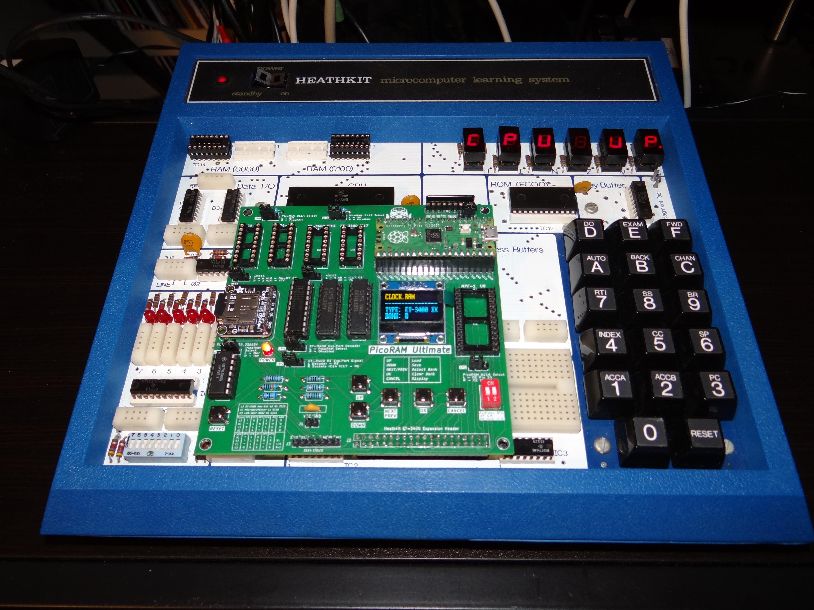
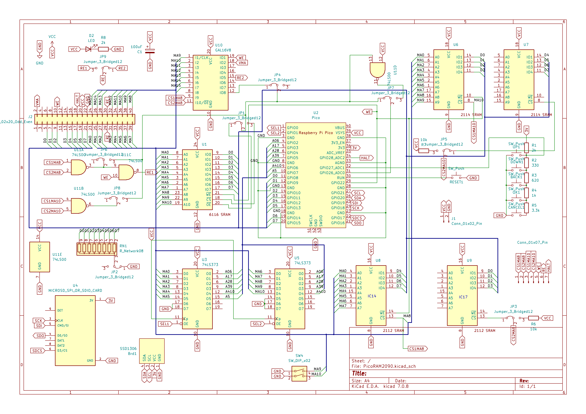
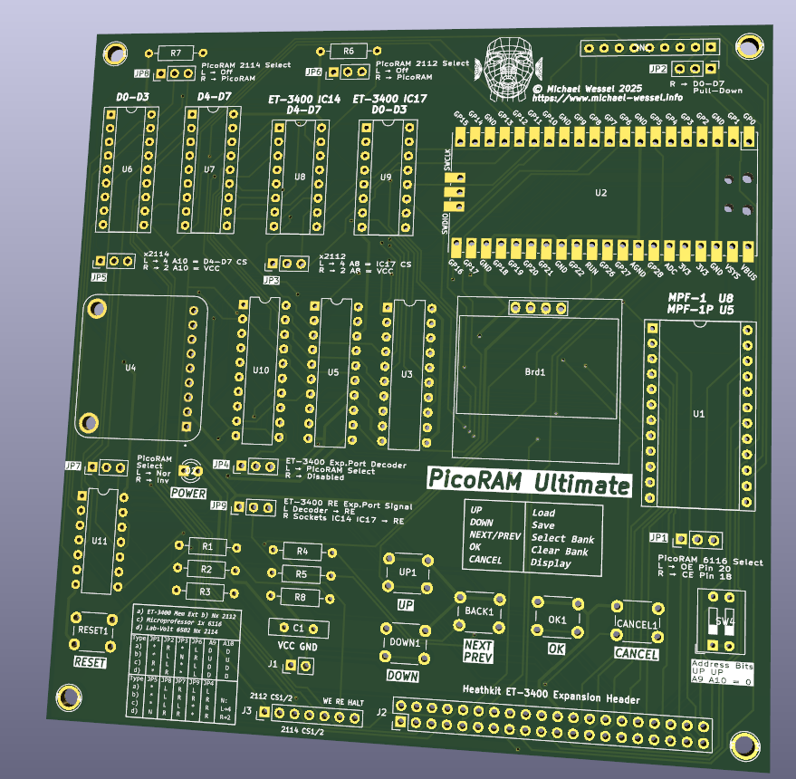
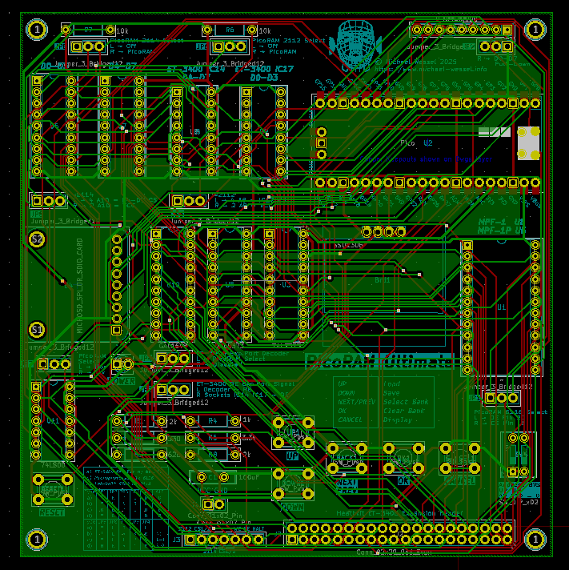

# picoram-ultimate

A Raspberry Pi Pico (RP2040)-based SRAM Emulator and SD Card Interface
for vintage Single Board Computers (SBCs).

## About

PicoRAM Ultimate replaces some (or all) of the RAM chips of these
systems by emulating them in software with a Raspberry Pi Pico
(RP2040) microcontroller, slightly overclocked at 250 MHz. PicoRAM is
equipped with an SD card to store and load whole memory dumps to and
from SD card. These memory dump `.RAM` files are similar to Intel HEX
ASCII format and can be edited easily by hand on the PC. The utilized
FAT file system facilitates data / file exchange with the PC or Mac.



Currently supported SBCs / host machines are:
- Stock Heathkit ET-3400: MC6800 CPU, either 2x 2112 (512 Bytes) or 4x 2112 (1 KB)
- Stock Heathkit ET-3400A: MC6808 CPU, 2x 2114 (512 Bytes only!)
- Heathkit ET-3400 memory expansion mode: MC6800 CPU, 2 KBs via expansion header and additional GAL16V8 address decoder
- Heathkit ET-3400A memory expansion mode: MC6808 (or MC6802) CPU, 2 KBs via expansion header and additional GAL16V8 address decoder 
- Multitech Microprofessor MPF-1, MPF-1B and MPF-1P: Z80 CPU, 1x 6116, 2 KBs  
- Lab-Volt 6502: 6502 CPU, 2x 2114, 1 KB
- Philips MC6400 MasterLab: INS8070 SC/MP III CPU, 2x 2114, 1 KB
- Heathkit ET-3400 & ET-3400A ROM emulation: using the expansion header, and having the GAL map into the `0xF800` to `0xFFFF` address range, we can use PicoROM as a ROM emulator. 

The [development
logs](https://hackaday.io/project/194092-picoram-6116-sram-emulator-sd-card-interface)
are on [Hackaday.](https://hackaday.com)

This project is a follow-up to [PicoRAM 2090 for the Busch Microtronic
Computer System](https://github.com/lambdamikel/picoram2090) and
[PicoRAM 6116 for the Microprofessor
MPF-1](https://github.com/lambdamikel/picoram6116).

## Video

[This YouTube video](https://youtu.be/UJutVvjddcg) shows most 
currently suported machines (with the exception of the MPF-1P):


## Latest News

### January 2026

- ROM emulation for the Heathkit ET-3400 machines over IO expansion
  header is supported by now - thanks to Peter K. for suggesting
  this. This is a useful feature in case you plan on developing you
  own monitor program, or changing / extending the standard
  monitor. Firmware version 1.8 supports this; note that emulated ROM
  is write protected, and you will still need the original SRAM chips
  installed as well. However, the (EP | P)ROM chip needs to be pulled,
  and a [different GAL address](src/et3400_decoder_0xf800/) must be
  used to map into the ROM memory region `0xfc00 - 0xffff`. The
  monitor RAM files for the SD card are available as well
  ([here](software/et-3400/ROM3400.RAM) and
  [here](software/et-3400a/ROM3400A.RAM)).



  Here is [a YT video.](https://youtu.be/Iy9S-a9cPTU)

- The Heathkit ET-3400A with expansion header is supported by now -
  firmware version 1.7 has been uploaded. This gives you 2 KBs of RAM.


Here is [a YT video.](https://youtu.be/NRePFKi3Nig)

- The stock Heathkit ET-3400A is supported by now - firmware version 1.6 
has been uploaded. 


Here is [a YT video.](https://youtu.be/SLuOrD5KGnc)

- **Unfortunately, the current version of PicoRAM Ultimate has a PCB bug: 
the position of the RE signal on the header is incorrect. Apologies
for that.**

You can see that in the schematics here:


When I wired up the IO header on my ET-3400, I flipped left and right
and put it on pins 30 and 29 instead of 12 and 11, where they should
have been.

I only noticed now, with my new ET-3400A, which already came with the
RE signal wired up on the IO header (I only had to install the data
lines), that the position didn't match. And indeed, the ET-3400A
schematics lists the RE pin positions as follows - you see the difference:


There is an easy fix for this - don't use JP9, but a DuPont wire that
runs directly into the breadboard RE signal, as shown in these
pictures:


Eventually, I will create a new PCB version with this bug fix. But for
now, the workaround is sufficient. 


### October 2025

During my [RetroChallenge 2025/10
contribution](https://hackaday.io/project/204153-3d-graphics-on-the-microprofessor-mpf-1b),
I encountered a pretty nasty issue which took me quite a while to
debug and resolve. Mostly chasing red herrings. 

My [rotating 3D Cube](https://youtu.be/pLtGfMtQikc) was glitching, and
it took me a long time to realize that this was caused by noisy ADC
button decoding and inappropriate ADC level thresholds. The problem
was that this happened without visual feedback in the UI, so I was
unware of it. Now, for each detected button press, the SRAM emulation
is halted; and also for spurious button presses that don't cause an UI
action (the `CANCEL2` button was responsible). Now, halting the SRAM
emulation can only work properly if the Z80 WAIT signal is connected
to PicoRAM, which I had not in this case. Sometimes, I simply hold the
RESET button manually on the Microprofessor instead whilst operating
PicoRAM. Obviously, you can't just halt SRAM emulation and not halt
the CPU and expect it to run properly.

So, this problem was fixed by adjusting the ADC threshold levels in
the `ULTIMATE.INI` file. However, I didn't like that the spurious button
presses weren't reported and happened "silently", leaving me unaware
of what was happening. In the UI loop code, there was no `switch case`
that caught this case, and a `default` clause was missing as well. I
have now added such a `default` clause. It will show an error message
on the display informing the user about inadequate ADC button
threshold levels in the init file that may cause SRAM emulation
glitches.

**Please install the [new firmware (Version
1.5).](firmware/picoram_ultimate_v1.5.uf2)**

## Overview 

PicoRAM Ultimate is powered directly from the host machine; i.e., via
the 5V and GND SRAM socket power pins.

To emulate SRAM, PicoRAM needs memory addresses, the 8bit data bus, as
well as chip select and write enable signals. These are provided from
either the 2112 sockets, the 2114 sockets, the 6116 socket, or the
Heathkit expansion header.

The pinouts of these vintage SRAM chips can be found here: 


The specs of these vintage SRAM chips are: 
- 2112: 256 x 4 bits
- 2114: 1024 x 4 bits
- 6116: 2048 x 8 bits 

Whereas the primary mode of operation is to simply use ribbon cables
connecting PicoRAM to the host machine's SRAM sockets, there is also
an extension header option on the PicoRAM PCB that allows to neatly
and directly connect PicoRAM to the Heathkit ET-3400. In this case,
the address and data bus as well as the control signals are not
supplied via the SRAM chip sockets, but over the expansion header. A
dedicated address decoder is used in this case (GAL16V8).

PicoRAM generates a READY/BUSY/HALT signal for the CPU in order to
suspend CPU operation while it cannot serve the RAM content (i.e.,
during file or UI operations). Power (VCC = 5V and GND) is fed in from
the sockets and connectors as well (i.e., whatever socket / connector
is being used to connect to the host machine supplies power to
PicoRAM).

PicoRAM has a convenient OLED-based UI. The hexadecimal ASCII-based
file representation of the memory content and FAT32 file system
facilitates editing and exchange of memory dumps (programs and data)
with a PC or Mac.

PicoRAM also offers an auto-load function - programs can be loaded
automatically into the host machine when it powers up (as if these
were EPROM-based programs).

A number of jumpers must be set to match the host machine. These
jumper settings can be found on the PCB as well:



## Features 

- Supports multiple host machines: ET-3400 (6800), ET-3400a (6808),
  Lab-Volt 6502, Microprofessor MPF-1 (Z80) series, and Philips MasterLab
  MC6400 (INS8070).

- Convenient PicoRAM configuration: PicoRAM has one universal firmware
  that supports all host machines; the host machine is specified in
  the `ULTIMATE.INI` init file.  In addition, some jumpers have to be
  set to configure PicoRAM for the host machine, but no
  firmware reprogramming is required.

- SD card: loading and saving of programs (full SRAM memory dumps) and
  easy file exchange with the PC (FAT32 filesystem). ASCII HEX format.

- Comfortable UI: 5 buttons and an OLED display.

- Four user memory banks: quadruples the machine's memory; the
  currently active memory bank can be selected via the `NEXT/PREV` button. 

- Autoload feature: the `ULTIMATE.INI` file is loaded during startup
  and allows the specification of an autoload program for each of the
  4 memory banks.

- Easy build & installation: PicoRAM 6116 uses pre-assembled
  off-the-shelf modules and through-hole components only, and no
  (destructive) modifications to the SBCs are required (e.g., trace
  cuts). It may be necessary to install chip sockets though.

## User Interface

The PicoRAM OLED display (if not turned off) shows the currently
loaded RAM file, the machine type, and the current bank number:


On the main screen, the 5 buttons have the functions listed in the legend:


During file operation (i.e., when a file is loaded from or saved to SD
card), the buttons take on additional functions for file selection,
file name creation, to confirm or cancel operations, and so on. It
will be obvious (i.e., intuitive) how to use them.

## The `ULTIMATE.INI` Configuration / Initialization File

The 5 UI buttons are read over an analog input on the Pico and mapped
to a value within the HEX interval `0x000` - `0xFFF` by the Pico's
analog-to-digital converter (ADC). The different buttons produce
different values in this range. Unfortunately, the analog levels on
the Pico are very noisy and also vary from machine to machine, depend
on the host machine power supply, etc.  These ADC values for the
different buttons are mapped to specific UI buttons by means of
thresholds; e.g., an ADC value below `0xA00` but higher than `0x800`
means the `CANCEL` button has been pressed, a value within `0x500` to
`0x800` corresponds to a push of the `OK` button, and so and so
forth. These threshold intervals are specified in the `ULTIMATE.INI`
file.

**Note that proper thresholds are extremely important for a reliable
and error-free operation of PicoRAM.** Every time a UI button push is
detected, the Pico onboard LED will be lit and RAM emulation is paused
by pulling down the WAIT/READY/BUSY line of the host system CPU. If
PicoRAM should detect false (random, spurious) button presses due to
ADC fluctuations and noise, then it is likely that the `CANCEL` button
threshold is set too high. Or, if you are not getting the right
function for a button (e.g., the `CANCEL` button acts as the `OK`
button), then the thresholds must be adjusted to match your machine as
well. There are two methods for "tuning" these thresholds, which are
described in the next subsection. But first, let us discuss an example
`ULTIMATE.INI` file (here, for the Philips MasterLab):

```
MASTERLAB
F00
F00
B00
800
500
200
NIMM.RAM
HEXCOUNT.RAM
NUMGUESS.RAM

0
```

(note that UNIX EOL is required here - a single newline / `0x0A` character!). 

The file lists, in this order:
- the name of the machine (machine type identifier) 
- the analog threshold for the CANCEL buttons (used in YES/NO dialogues) 
- the 2nd analog threshold for the CANCEL buttons (toplevel menu)
- the analog threshold for the OK button
- the analog threshold for the NEXT/PREV button
- the analog threshold for the UP button
- the analog threshold for the DOWN button
- 4 lines for the 4 autoload programs for banks 0 to 3 (use an empty line for no program)
- 0 or 1 - 0 for normal operation, and 1 to enter a debugging program which can be used to determine the above mentioned analog thresholds for the buttons. 

So how do we dermine these analog threshold values in case the 
supplied default init file doesn't work for your machine? Read further.

### Determining Analog Button Thresholds

There are two methods:

1. The PicoRAM firmware contains a *Button Tuning* function which
allows you to acquire the threshold values interactively.  You are
being asked to push each buttons 5 times, and at the end, you will
have the option to write the acquired threshold values to an
`ADC.INI` file on SD card: 

    This file can then be hand-edited and become the basis of a proper
`ULTIMATE.INI` file.  This *Button Tuning* functionality can be
invoked by holding down any button during start-up / reset of
PicoRAM. Examples of proper init files can be found
[here](software/).

2. If you start PicoRAM from an `ULTIMATE.INI` file that has a `1`
entry as its last line, it will start an infinite loop, displaying the
analog values as they are being read. You can determine the threshold
for each button by inferring a safe upper bound from the values you
are observing. For example, in this picture we are observing (noisy)
values for the `OK` button in the `0x800` to `0x8F0` range:


    A threshold value of `0x900` would hence be a good choice for the
`OK` button threshold in the `ULTIMATE.INI` file (4th line).

## Host Machine-Specific Configuration

PicoRAM supports multiple host machines / SBCs. A machine
type-identifier in the first line on the `ULTIMATE.INI` file
determines the machine type.

The following types are supported; each host system is described in
more detail below.

- `HEATHKIT`: stock Heathkit ET-3400. PicoRAM plugs into the `IC14` and `IC17` 2112 SRAM sockets and provides 512 bytes or 1 KB of SRAM (configurable).
- `ET-3400A`: stock Heathkit ET-3400A. PicoRAM plugs into the `U14` and `U15` 2114 SRAM sockets and provides 512 Bytes of SRAM (*not* 1 KB, see below for an explanation).
- `HEATHKIT+`: Heathkit ET-3400 with extension header. PicoRAM plugs onto the extension header and provides 2 KBs of SRAM. This required an additional address decoder (a GAL16V8). See below for details.
- `HEATHKIT+ROM`: Heathkit ET-3400 with extension header, ROM emulation mode. Requires installed SRAMs (2 or 4 2112s), the PROM chip (IC12) pulled, and [this](src/et3400_decoder_0xf800/) address decoder. Load [the ET3400 ROM](software/et-3400/ROM3400.RAM); at `0xf800`, you will find my *Towers of Hanoi* program, and the 1 KB monitor ROM (`CPU UP`) starts at `0xfc00`. 
- `HEATHKITA+`: Heathkit ET-3400A with extension header. PicoRAM plugs onto the extension header and provides 2 KBs of SRAM. This required an additional address decoder (a GAL16V8). See below for details.
- `HEATHKITA+ROM`: Heathkit ET-3400A with extension header, ROM emulation mode. Requires installed SRAMs (2 2114s), the (E)PROM chip (U12) pulled, and [this](src/et3400_decoder_0xf800/) address decoder. Load [the ET3400A ROM](software/et-3400a/ROM3400A.RAM); at `0xf800`, you will find my *Towers of Hanoi* program, and the 1 KB monitor ROM (`CPU UP`) starts at `0xfc00`. 
- `LABVOLT`: Lab-Volt 6502 trainer. PicoRAM plugs into the `RAM (D0-D3)` and `RAM (D4-D7)` 2114 sockets and provides 1 KB of SRAM. 
- `MASTERLAB`: Philips MC6400 MasterLab. PicoRAM plugs into the 2 2114 SRAM sockets and provides 1 KB of SRAM. 
- `MPF`: Multitech Microprofessor MPF-1, MPF-1B, MPF-1P. PicoRAM plugs into the `U8` 6116 socket on the MPF-1(B), or the
  `U5` 6116 socket on the MPF-1P and provides 2 KBs of SRAM. 

### Stock Heathkit ET-3400 without Expansion Header

The Heatkit ET-3400 is a Motorola MC6800-based CPU trainer from ~1976
and can be considered as one of the very first CPU trainers.

The stock system came with only 2 2112 SRAM chips (`IC14` and `IC15`),
amounting to 256 bytes.  Users could upgrade the machine to 512 bytes
by plugging in two more 2112 SRAMs into `IC16` and `IC17`. PicoRAM
connects to `IC14` and `IC17` and can emulate 512 bytes of memory in the
address range `0x0000 - 0x01ff`.


Note that this applies to the ET-3400 with *original MC6800 CPU with
no upgraded crystal*, and that you will need a jumper cable from the
`HALT` pin of PicoRAM's `J3` header to the ET-3400's `HALT` breadboard
connector, as shown in the above picture.

**The machine type string (1st line in the `ULTIMATE.INI`) is
``HEATHKIT``.**

The jumper configuration for this mode is (note: the silkscreen on the
current PCB is incorrect, use these settings!): 

| JP1 | JP2 | JP3 | JP4 | JP5 | JP6 | JP7 | JP8 | JP9 | A9 | A10 | 
|-----|-----|-----|-----|-----|-----|-----|-----|-----|----|-----|
| *   | R   | N   | R   | *   | R   | R   | L   | -   | U  | U   | 

Where `*` = don't care, `-` for NO JUMPER INSTALLED, and for `N`: 

- L: 4x 2112 (IC14 - IC17), `0x0000` - `0x00FF` and `0x0100` - `0x01ff`, 512 bytes
- R: 2x 2112 (IC14, IC15),  `0x0000` - `0x00FF`, 256 bytes 

### Stock Heathkit ET-3400A without Expansion Header

The Heatkit ET-3400A is a Motorola MC6808-based CPU trainer from
~1976, the successor of the ET-3400. It is quite a bit faster than the
ET-3400, uses a 6808 instead of the 6800, and 2 2114 SRAM chips
instead of the 2 (or 4) 2112 SRAM chips in the ET-3400.

The stock system comes with 2 2114 SRAM chips (`U14` and `U15`),
providing 512 Bytes from `0x0000 - 0x01ff`. Interestingly, only 512
Bytes are utilized by the ET-3400A instead of the full 1 KB provided
by the 2 2114, as the Heathkit designers did not connect the 10th
address bit (A9) to `U14`, `U15`.


You will also need a jumper cable from the `HALT` pin of PicoRAM's
`J3` header to the ET-3400's `HALT` breadboard connector, as shown in
the above picture.

**The machine type string (1st line in the `ULTIMATE.INI`) is
``ET-3400A``.**

The jumper configuration for this mode is (note that the 
silkscreen of the current PCB doesn't list the ET-3400A configuration): 

| JP1 | JP2 | JP3 | JP4 | JP5 | JP6 | JP7 | JP8 | JP9 | A9 | A10 | 
|-----|-----|-----|-----|-----|-----|-----|-----|-----|----|-----|
| *   | R   | *   | R   | *   | *   | R   | R   | -   | D  | D   | 

Where `*` = don't care, and  `-` for NO JUMPER INSTALLED,

### Stock Heathkit ET-3400 with Expansion Header

If your ET-3400 has the expansion header installed, PicoRAM Ultimate
can upgrade your machine to 2 KBs, address range: `0x0000 - 0x07ff`.


Note that this applies to the ET-3400 with *original stock MC6800 CPU
with no upgraded crystal with an installed (and fully wired-up)
expansion header.*

The machine type string (1st line in the `ULTIMATE.INI`) is
``HEATHKIT+``.

PicoRAM plugs onto the expansion header: 


In particular, it is assumed that the databus wires have been soldered
in (by default, the PCB only accommodates for the address bus and the
control signals!), as well as the `RE` signal:


The databus and `RE` signal mods are also described in the 
[IO extension box manual](docs/e34modkt.pdf). 


**Unfortunately, I installed the RE signal incorrectly in my ET-3400 when
I installed the mod. Please read further.**

For this mode, the 16V8 GAL chip `U10` **must** be installed, as the
RAM select signal can not longer be generated from the SRAM sockets,
due to the larger address range. Here are [the (optional) GAL
source](src/et3400_decoder_0x0000/ETGAL.PLD) and [the required JED
firmware file](src/et3400_decoder_0x0000/ETGAL.jed) (i.e., for
programming a 16V8 GAL with a standard TL-866 EPROM programmer and
MiniPro). The standard decoder decodes the memory region `0x0000` to
`0x07ff`; you will hence need to remove the SRAM chips.

However, it also possible to change the address decoder - by changing the
GAL select equation

```
RAM_SELECT = ! A11 & ! A12 & ! A13 & ! A14 & ! A15 ;
```

we can decode any address region in 2 KB pages (note that `A0` to
`A10` = 11 address bits = 2048 bytes = 2 KBs).

**To use PicoRAM as a PicoROM,** we can simple pull the (P)ROM / EPROM
chip, and change the decoder such that it covers the ROM address range
`0xFC00 - 0xFFFF`. Due to the minimal 2 KB page size, this range would
be `0xF800 - 0xFFF`:

```
RAM_SELECT = A11 & A12 & A13 & A14 & A15 ;
```

(`RAM_SELECT` is really a `ROM_SELECT` then). The ROM-decoder GAL
files are availalable [here.](src/et3400_decoder_0xf800/):


Load [the ET3400 Monitor ROM](software/et-3400/ROM3400.RAM); at
`0xf800`, you will find my *Towers of Hanoi* program, and the 1 KB
monitor ROM (`CPU UP`) starts at `0xfc00`. Note that the ROM memory is
write-protected; hence, you cannot change it. Use the standard RAM
(`0x0000 - 0x01ff`) for writeable memory; however, you can still use
the ROM region from `0xf800 - 0xfbff` for your own (ROM) program (like
the Towers of Hanoi here).

Originally, PicoRAM Ultimate was designed in such a way that **JP9
could be used in left jumper position** to route the GAL-generated RE
signal into the IO expansion header's RE pin. However, since I wired
it up incorrectly in my ET-3400, this won't work with your ET-3400 -
it only works with mine: 



**Eventually, I will re-design the PCB and fix this bug - stay tuned, updates
soon!** 

**Instead, you will have to use a DuPont jumper wire as shown in the following
two pictures:**


The jumper settings are as follows (plus RE jumper cable into the RE
sockets) - note that the silkscreen table is incorrect, due
to JP9: 


| JP1 | JP2 | JP3 | JP4 | JP5 | JP6 | JP7 | JP8 | JP9 | A9 | A10 | 
|-----|-----|-----|-----|-----|-----|-----|-----|-----|----|-----|
| *   | R   | *   | L   | *   | L   | R   | L   | +   | D  | D   |

Here, `+` means: **pull the jumper, but connect the DuPont jumper wire
to the left pin of JP9 and route it into the RE socket.**


### Stock Heathkit ET-3400A with Expansion Header

If your ET-3400A has the expansion header installed, PicoRAM Ultimate
can upgrade your machine to 2 KBs, address range: `0x0000 - 0x07ff`.


The machine type string (1st line in the `ULTIMATE.INI`) is
``HEATHKITA+``.

The same notes as for the ET-3400 and the expansion header apply.
Note that the ET-3400A already has the RE and Phi2 wires
pre-installed, but the databus cables need to be soldered in as well. 

For ROM emulation, use [the ROM decoder GAL
files.](src/et3400_decoder_0xf800/), and leave the SRAM chips (2x
2114) installed. Load [the ET3400A Monitor
ROM](software/et-3400a/ROM3400A.RAM); at `0xf800`, you will find my
*Towers of Hanoi* program, and the 1 KB monitor ROM (`CPU UP`) starts
at `0xfc00`. Note that the ROM memory is write-protected; hence, you
cannot change it with the monitor. Use the standard RAM (`0x0000 -
0x01ff`) for writeable memory; however, you can still use the ROM
region from `0xf800 - 0xfbff` for your own (ROM) program (like the
Towers of Hanoi here).

The same configuration as for the ET-3400 with expansion header
applies: 


| JP1 | JP2 | JP3 | JP4 | JP5 | JP6 | JP7 | JP8 | JP9 | A9 | A10 | 
|-----|-----|-----|-----|-----|-----|-----|-----|-----|----|-----|
| *   | R   | *   | L   | *   | L   | R   | L   | +   | D  | D   |

Here, `+` means: **pull the jumper, but connect the DuPont jumper wire
to the left pin of JP9 and route it into the RE socket.**


### Lab-Volt 6502 

The Lab-Volt 6502-based CPU trainer was released by **FESTO Didactic**
in the early 1980s; apparently, the machine was being manufactured at
least until 1999 - my accompanying textbook copy is the "16th
printing, 1999". The trainer is equipped with 2 2114 SRAM chips (1 KB
of RAM):


The machine type string (1st line in the `ULTIMATE.INI`) is
``LABVOLT``. 

The jumper settings are as follows: 

| JP1 | JP2 | JP3 | JP4 | JP5 | JP6 | JP7 | JP8 | JP9 | A9 | A10 | 
|-----|-----|-----|-----|-----|-----|-----|-----|-----|----|-----|
| *   | R   | *   | R   | N   | L   | R   | R   | *   | D  | D   | 

Where `*` = don't care and for `N`: 

- R: 2x 2114, `0x0000` - `0x03FF`, 1 KB  

Moreover, the `JP5` setting for 2 KBs 

- L: 4x 2114, `0x0000` - `0x07FF`

**does not work for the Lab-Volt** - but might work for a different
host machine with 4 2114 chips. Check [the schematics.](pics/schematics.png)


A jumper wire must be routed from the `HALT` pin on `J3` to `RDY (22)` 
pin on the machine's system bus header (top-left header).

### Philips MasterLab MC6400 

The Philips MasterLab MC6400 is a INS8070 (SC/MP III)-based CPU
trainer released in ~1984. Despite the Philips label, the machine was
only released in Germany, and likely developed in my birth town,
Hamburg / Germany. More infos can be found
[here](https://www.classic-computing.de/wp-content/uploads/2024/10/load10web.pdf). It
is equipped with 2 2114 SRAM chips (1 KB of RAM):


You will have to modify your MC6400 and put in sockets to accommodate
PicoRAM as follows. The PCB is of very good quality, and with a little
bit of soldering skills you will have no issues accomplishing this:


The machine type string (1st line in the `ULTIMATE.INI`) is
`MASTERLAB``. 

The jumper settings are as follows: 

| JP1 | JP2 | JP3 | JP4 | JP5 | JP6 | JP7 | JP8 | JP9 | A9 | A10 | 
|-----|-----|-----|-----|-----|-----|-----|-----|-----|----|-----|
| *   | R   | *   | R   | N   | L   | R   | R   | *   | D  | D   | 

Where `*` = don't care and for `N` - emulate

- R: 2x 2114, `0x1000` - `0x13FF`, 1 KB (note that the RAM starts at
  address `0x1000` on the MC6400).

Moreover, the `JP5` setting for 2 KBs 

- L: 4x 2114, `0x0000` - `0x07FF` 

**does not work for the MasterLab** - but might work for a different
host machine with 4 2114 chips. Check [the schematics.](pics/schematics.png)

Note that a jumper wire is required that connects the `HALT` pin of
the `J3` header to the MasterLab's `Master Reset` as follows - this is
the first top-most connector socket that is not occupied by a wire
bridge:


It can be seen more clearly in this pinout diagram:


### Multitech Microprofessor MPF-1 

The company Multitech (nowadays: Acer) released a series of Z80-based
trainers as early as 1981 (MPF-1); later models included a Palo Alto
TinyBASIC EPROM (MPF-1B), and the much more powerful and capable
MPF-1P (One Plus) that featured an alphanumeric keyboard and VFD, had
a symbolic 2pass assembler with line editor, a full floating point
BASIC, and Forth! More info about these fascinating machines can be
found
[here.](https://hackaday.io/project/183618-exploring-the-microprofessor)

The machine type string (1st line in the `ULTIMATE.INI`) is
``MPF``. PicoRAM emulates one 6116 chip and supplies 2 KBs of SRAM. 


The jumper settings are: 

| JP1 | JP2 | JP3 | JP4 | JP5 | JP6 | JP7 | JP8 | JP9 | A9 | A10 | 
|-----|-----|-----|-----|-----|-----|-----|-----|-----|----|-----|
| R   | L   | *   | R   | *   | L   | L   | L   | *   | D  | D   |

On the MPF-1(B), PicoRAM should be plugged into the `U8` 6116 socket.
For the MPF-1P, the `U5` 6116 socket should be used.

For `U8` on the MPF-1(B), the 2 KBs of RAM *usually* appear in the
address range `0x1800 - 0x1FFF`. On the MPF-1P, `U6` is mapped to
`0xf800 - 0xFFFF`.

The `HALT` pin of the `J3` header needs to be connected to **pin 37**
on the MPF's (1, 1B, 1P) primary (top-left) extension header via a
jumper wire.  Double check `JP1` as well; for the Microprofessor, it
needs to be set to R (for `CE`, pin 18).

I also recommend to add an additional decoupling capacitor (104, 0.1
uF / 100 nF) between GND and VCC of the 6116 socket to help with
noise:


**If you encounter stability problems, try removing the 10k resistor
array completely.**


Also have a look at [the predecessor project, PicoRAM 6116.](https://github.com/lambdamikel/picoram6116)

## Host Machine-Specific Software and Example `ULTIMATE.INI` Initialization Files 

PicoRAM uses a FAT32-formatted (max 32 GB) Micro SD Card.

To get started, you can simply copy the sub-directory for the intended
host machine from [the software/ directory.](software/)


## Theory of Operation

The Raspberry Pi Pico emulates the SRAM of the host machine and is
overclocked to 250 MHz to make this possible; this is completely in
the safe range and does not affect the longevity of the RP2040 in any
negative way.

Due to a lack of GPIOs on the Pico, two 74LS373 (or 74F373)
transparent octal latches are used to multiplex the (max) 11-bit
address bus. The (up to) 11-bit address is read in two batches of 6
and 5 bits, using the `SEL1` and `SEL2` signals from the Pico to `OE`
(Output Enable) the first resp. second latch. The latches are merely
used for their tri-state capabilities.

Unlike my previous design, [PicoRAM
2090](https://github.com/lambdamikel/picoram2090), this design does
not utilize any voltage level converters. It turns out that the Pico
(RP2040) is really pretty much 5V-tolerant; also see [this article
from
Hackaday](https://hackaday.com/2023/04/05/rp2040-and-5v-logic-best-friends-this-fx9000p-confirms/)
and the [Hackaday coverage of PicoRAM
2090.](https://hackaday.com/2023/09/10/pi-pico-becomes-sram-for-1981-educational-computer/)


More details about the making of the project, and technical notes /
development logs can be found on the [PicoRAM 6116 Hackaday project
page](https://hackaday.io/project/194092-picoram-6116-sram-emulator-sd-card-interface)
and the [PicoRAM Ultimate Hackaday project
page.](https://hackaday.io/project/203133-picoram-ultimate)

## The Board 

### Schematics



Here is [a PDF of the schematics.](pics/schematics.pdf)

### Printed Circuit Board (PCB)

The current version is Rev. 1, June 2025.



There is also a [Bill of Material (BOM).](gerbers/BOM.csv)

**Note that the resistor array should be 10K (code: 103).** The 2112,
2114, 6116 chips are only sockets, obviously (so you don't actually
need to purchase any SRAM chips - PicoRAM emulates them).

### Gerbers 



See [here.](gerbers/gerbers.zip) 

## Firmware Image

The current version is 1.7, January 17th 2026. The `.uf2` image can be
found [here.](firmware/picoram_ultimate_v1.7.uf2)

## Firmware Sources

See [here.](src/)

## Acknowledgements

- Harry Fairhead for his [excellent
  book!](https://www.amazon.com/gp/product/1871962056)

- The authors of the libraries that I am using:

  - Carl J Kugler III carlk3:
    [https://github.com/carlk3/no-OS-FatFS-SD-SPI-RPi-Pico](https://github.com/carlk3/no-OS-FatFS-SD-SPI-RPi-Pico)

  - Raspberry Pi Foundation for the `ssd1306_i2c.c` demo.

