# picoram-ultimate rev. 2

A Raspberry Pi Pico (RP2040)-based (S)RAM / ROM Emulator, and SD Card Interface
for vintage Single Board Computers (SBCs) - **Revision 2.**

## About

**PicoRAM Ultimate Rev. 2** replaces some (or all) of the (S)RAM or ROM
chips of these systems and emulates them in software with a Raspberry
Pi Pico (RP2040) microcontroller, slightly overclocked at 250 
MHz. PicoRAM is equipped with an SD card to store and load whole
memory dumps to and from SD card. These memory dump `.RAM` files are
similar to Intel HEX ASCII format and can be edited easily by hand on
the PC or Mac; the utilized FAT file system facilitates data / file exchange.  

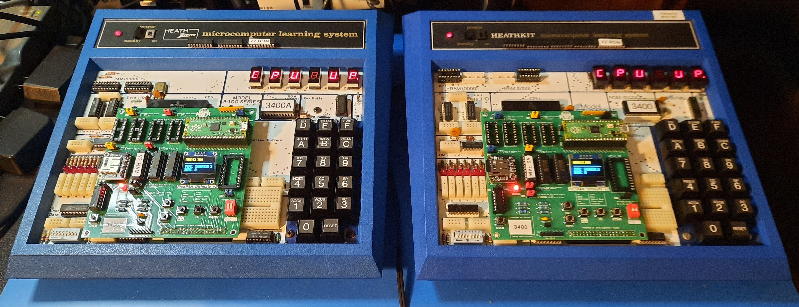

Currently supported SBCs / host machines are:
- Stock Heathkit ET-3400: MC6800 CPU, either 2x 2112 (256 Bytes) or 4x 2112 (512 Bytes)
- Stock Heathkit ET-3400A: MC6808 CPU, 2x 2114 (512 Bytes only!)
- Heathkit ET-3400 memory expansion mode: MC6800 CPU, 4 KBs via expansion header and additional GAL16V8 address decoder
- Heathkit ET-3400A memory expansion mode: MC6808 (or MC6802) CPU, 4 KBs via expansion header and additional GAL16V8 address decoder
- Multitech Microprofessor MPF-1, MPF-1B and MPF-1P: Z80 CPU, 1x 6116, 2 KBs  
- Lab-Volt 6502: 6502 CPU, 2x 2114, 1 KB 
- Philips MC6400 MasterLab: INS8070 SC/MP III CPU, 2x 2114, 1 KB
- Heathkit ET-3400 & ET-3400A ROM emulation: either 2 or 4 KBs of emulated ROM, and it is possible to replace the monitor
(EP|P)ROM (i.e., with your custom ROM monitor program). 

The [development
logs](https://hackaday.io/project/194092-picoram-6116-sram-emulator-sd-card-interface)
are on [Hackaday.](https://hackaday.com)

This project is a follow-up to [PicoRAM 2090 for the Busch Microtronic
Computer System](https://github.com/lambdamikel/picoram2090), 
[PicoRAM 6116 for the Microprofessor
MPF-1](https://github.com/lambdamikel/picoram6116), and [PicoRAM
Ultimate Rev. 1.](README-v1.md) PicoRAM Rev. 1 users, please [refer to
the Rev. 1 documentation.](README-v1.md)

**In the following, PicoRAM Ultimate refers to the hardware
Rev. 2. Please note that this repository contains files for both
revisions (`rev1`, `rev2`). The current firmware Version 2 works with
both hardware Rev. 1 and Rev. 2; however, the 4 KB configurations
(machine settings) are only supported with Rev. 2 hardware. Some
pictures still show the old Rev. 1 - note that the Rev. 1 vs. Rev. 2
differences only matter with regard to the Heathkit ET-3400 machines
(and only if PicoRAM is used over the extension header).**

## Video

[This YouTube video (of the Rev. 1 board)](https://youtu.be/UJutVvjddcg) shows most 
currently suported machines (with the exception of the MPF-1P):

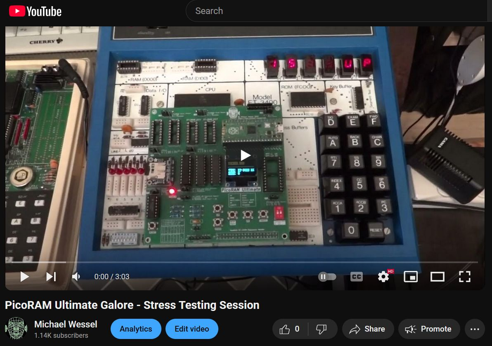

Here is [a YouTube Video of the Rev. 2 board, showing
both the Heathkit ET-3400 and the ET-3400A.](https://youtu.be/Ko7TkqEhiPQ) 

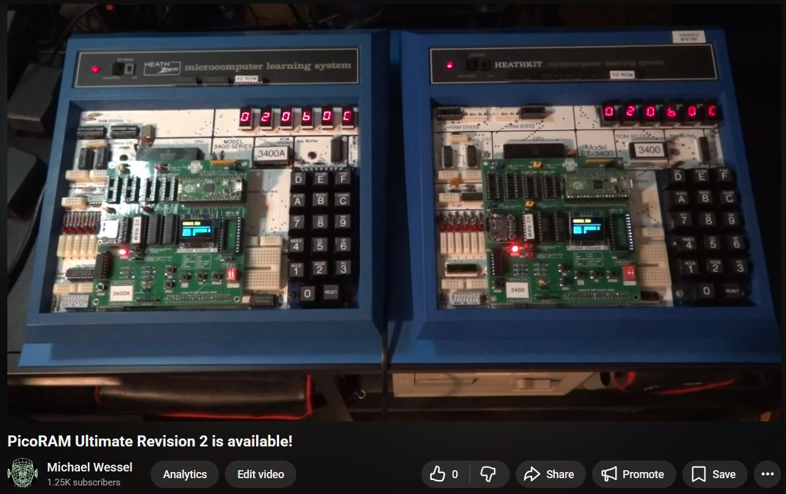


## Latest News

### February 2026

Firmware version 2.1 adds some experimental IO facilities to PicoRAM
for the ET-3400 (not A currently), namly, text and graphics commands.

To use this experimental mode, the [`0x1000` to `0x1ff` address
decoder is required](src/et3400_decoder_0x1000/rev2/), and the 4x 2112
SRAM chips for 512 Bytes of SRAM memory are retained. In this mode,
PicoRAM acts as a \emph{ROM emulator for now}, so writes to the
`0x1000` to `0x1ff` are protected, but it listens to writes to address
`0x1800` which acts as a "one byte serial" communication channel from
the ET-3400 to PicoRAM for driving the text and graphics display
(i.e., for sending IO commands). There are a number of demo programs
in [this folder.](software/et-3400/rev2/io-rom-4kb-1000/) that
demonstrate how to utilize the provided text and graphics
commands. Note that the machine identifier is `3400IO` for this mode;
also see the supplied
[`ULTIMATE.INI`](software/et-3400/rev2/io-rom-4kb-1000/ULTIMATE.INI)
and the [three demo programs](software/et-3400/rev2/io-rom-4kb-1000/)
which are supplied in `.A68` assembly format. Large portions were
written by CoPilot, especially for the visual / graphical [Towers of
Hanoi program
`HANOIG.RAM`](software/et-3400/rev2/io-rom-4kb-1000/HANOIG.A68).

It should be noted that mode is still experimental and not fully
stable yet; but have a loot at [this,](https://youtu.be/VSempOfuLcc)
[this,](https://youtu.be/9M1EXb85hKk) and
[this](https://youtu.be/RZBmiNyekSo) YT video to get an impression.
Overall, it already works pretty well. In particular, it is necessary
to not send the IO bytes to address `0x1800` too fast; processing
speed also depends on the command (unfortauntely, PicoRAM cannot block
the CPU while it is execution IO commands, as this results in unstable
operation). So proper "synchronization by hand" is required in order
to get stable operation. 

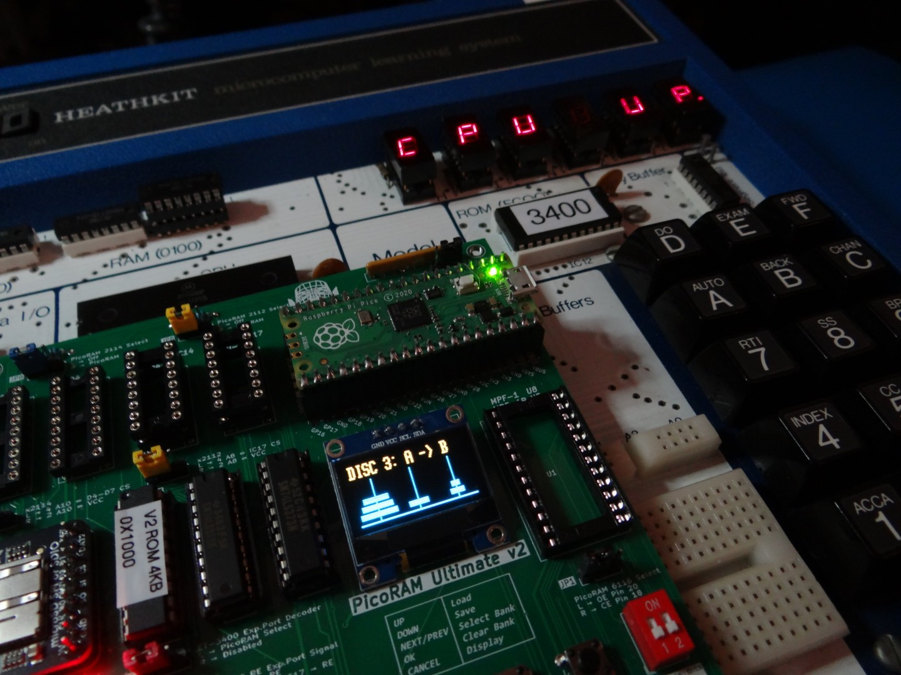

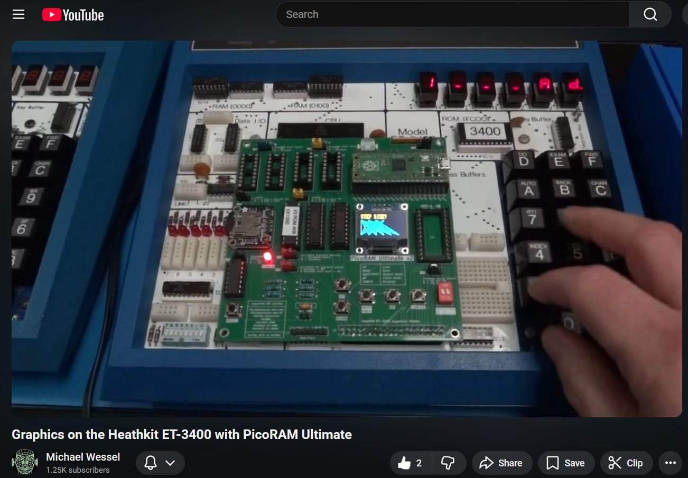 


## Overview

PicoRAM Ultimate is powered directly from the host machine; i.e., via
the 5V and GND SRAM socket power pins.

To emulate SRAM, PicoRAM needs memory addresses, the 8bit data bus, as
well as chip select and write enable signals. These are provided from
either the 2112 sockets, the 2114 sockets, the 6116 socket, or the
Heathkit expansion header.

The pinouts of these vintage SRAM chips can be found here: 

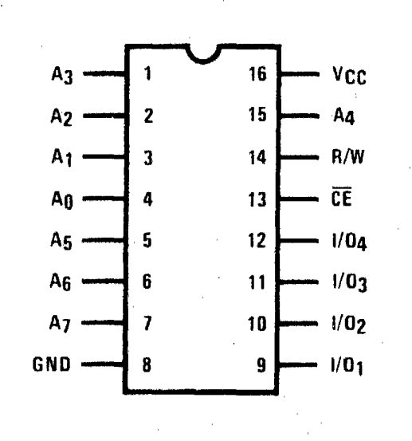

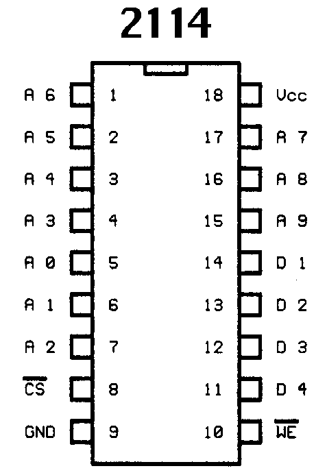

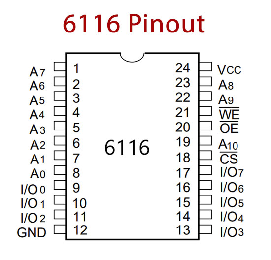

The specs of these vintage SRAM chips are: 
- 2112: 256 x 4 bits
- 2114: 1024 x 4 bits (in the ET-3400A, only 512 bytes are used though, as `A9` is left unconnected). 
- 6116: 2048 x 8 bits 

Whereas the primary mode of operation is to simply use ribbon cables
connecting PicoRAM to the host machine's SRAM sockets, there is also
an extension header option on the PicoRAM PCB that allows to neatly
and directly connect PicoRAM to the Heathkit ET-3400(A). In this case,
the address and data bus as well as the control signals are not
supplied via the SRAM chip sockets, but over the expansion header. A
dedicated address decoder is used in this case (GAL16V8).

The address decoder is only utilized for the Heathkit ET-3400(A), and
is fully programmable such that PicoRAM's emulated 4 KB of RAM / ROM
memory can be mapped into the address space starting at an arbitrary
address whose lower five address (`A0` to `A5`) bits are zero - i.e.,
the 4 KB page can start at any address divisible by 64. 

PicoRAM generates a READY/BUSY/HALT signal for the CPU in order to
suspend CPU operation while it cannot serve the RAM content (i.e.,
during file or UI operations). Power (VCC = 5V and GND) is fed in from
the sockets and connectors as well (i.e., whatever socket / connector
is being used to connect to the host machine supplies power to
PicoRAM).

PicoRAM has a convenient OLED-based UI. The hexadecimal ASCII-based
file representation of the memory content and FAT32 file system
facilitates editing and exchange of memory dumps (programs and data)
with a PC or Mac.

PicoRAM also offers an auto-load function - programs can be loaded
automatically into the host machine when it powers up (as if these
were EPROM-based programs).

A number of jumpers must be set to match the host machine. These
jumper settings can be found on the PCB silkscreen as well, although
incomplete. **It is hence best to refer to this README for the latest
jumper settings and supported SBCs.**

## Features 

- Supports multiple host machines: ET-3400 (6800), ET-3400A (6808),
  Lab-Volt 6502, Microprofessor MPF-1 (Z80) series, and Philips MasterLab
  MC6400 (INS8070).

- Convenient PicoRAM configuration: PicoRAM has one universal firmware
  that supports all host machines; the host machine is specified in
  the `ULTIMATE.INI` init file.  In addition, some jumpers must be set
  to match the host machine, but no firmware reprogramming is
  required.

- SD card: loading and saving of programs (full SRAM memory dumps) and
  easy file exchange with the PC (FAT32 filesystem). ASCII HEX format.

- Heathkit ET-3400(A) ROM emulation. 

- Comfortable UI: 5 buttons and an OLED display.

- Four user memory banks: the currently active memory bank can be 
  selected via the `NEXT/PREV` button. 

- Autoload feature: the `ULTIMATE.INI` file is loaded during startup
  and allows the specification of an autoload program for each of the
  4 memory banks.

- Easy build & installation: PicoRAM uses pre-assembled
  off-the-shelf modules and through-hole components only, and no
  (destructive) modifications to the SBCs are required (e.g., trace
  cuts). It may be necessary to install chip sockets though.

## User Interface

The PicoRAM OLED display (if not turned off) shows the currently
loaded RAM file, the machine type, and the current bank number:

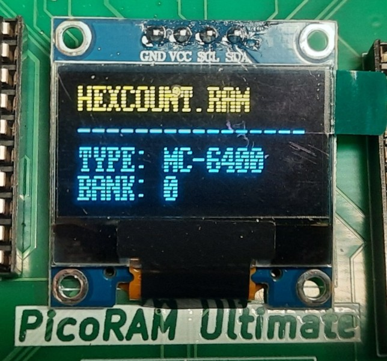

On the main screen, the 5 buttons have the functions listed in the legend:

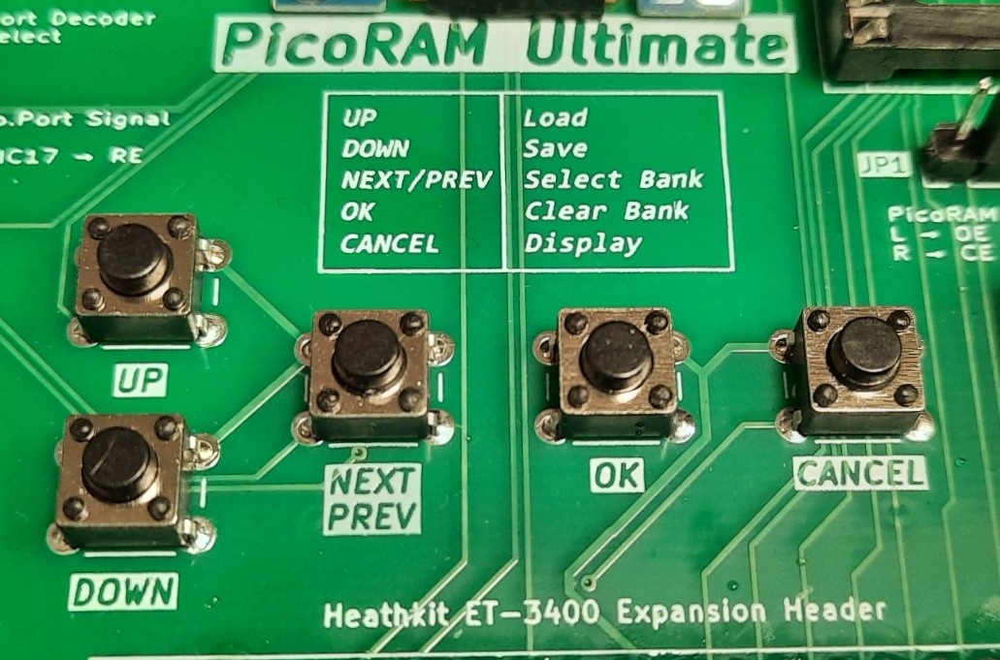

During file operation (i.e., when a file is loaded from or saved to SD
card), the buttons take on additional functions for file selection,
file name creation, to confirm or cancel operations, and so on. It
will be obvious (i.e., intuitive) how to use them.

## The `ULTIMATE.INI` Configuration / Initialization File

The 5 UI buttons are read over an analog input on the Pico and mapped
to a value within the HEX interval `0x000` - `0xFFF` by the Pico's
analog-to-digital converter (ADC). The different buttons produce
different values in this range. Unfortunately, the analog levels on
the Pico are very noisy and also vary from machine to machine, depend
on the host machine power supply, etc.  These ADC values for the
different buttons are mapped to specific UI buttons by means of
thresholds; e.g., an ADC value below `0xA00` but higher than `0x800`
means the `CANCEL` button has been pressed, a value within `0x500` to
`0x800` corresponds to a push of the `OK` button, and so and so
forth. These threshold intervals are specified in the `ULTIMATE.INI`
file.

**Note that proper thresholds are extremely important for a reliable
and error-free operation of PicoRAM.** Every time a UI button push is
detected, the Pico onboard LED will be lit and RAM emulation is paused
by pulling down the WAIT/READY/BUSY line of the host system CPU. If
PicoRAM should detect false (random, spurious) button presses due to
ADC fluctuations and noise, then it is likely that the `CANCEL` button
threshold is set too high. Or, if you are not getting the right
function for a button (e.g., the `CANCEL` button acts as the `OK`
button), then the thresholds must be adjusted to match your machine as
well. There are two methods for "tuning" these thresholds, which are
described in the next subsection. But first, let us discuss an example
`ULTIMATE.INI` file (here, for the Philips MasterLab):

```
MASTERLAB
F00
F00
B00
800
500
200
NIMM.RAM
HEXCOUNT.RAM
NUMGUESS.RAM

0
```

(note that UNIX EOL is required here - a single newline / `0x0A` character!). 

The file lists, in this order:
- the name of the machine (machine type identifier) 
- the analog threshold for the CANCEL buttons (used in YES/NO dialogues) 
- the 2nd analog threshold for the CANCEL buttons (toplevel menu)
- the analog threshold for the OK button
- the analog threshold for the NEXT/PREV button
- the analog threshold for the UP button
- the analog threshold for the DOWN button
- 4 lines for the 4 autoload programs for banks 0 to 3 (use an empty line for no program)
- 0 or 1 - 0 for normal operation, and 1 to enter a debugging program which can be used to determine the above mentioned analog thresholds for the buttons. 

So how do we dermine these analog threshold values in case the 
supplied default init file doesn't work for your machine? Read further.

### Determining Analog Button Thresholds

There are two methods:

1. The PicoRAM firmware contains a *Button Tuning* function which
allows you to acquire the threshold values interactively.  You are
being asked to push each buttons 5 times, and at the end, you will
have the option to write the acquired threshold values to an
`ADC.INI` file on SD card: 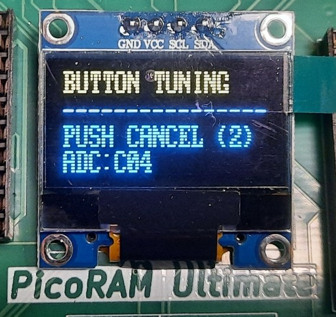

    This file can then be hand-edited and become the basis of a proper
`ULTIMATE.INI` file.  This *Button Tuning* functionality can be
invoked by holding down any button during start-up / reset of
PicoRAM. Examples of proper init files can be found
[here](software/).

2. If you start PicoRAM from an `ULTIMATE.INI` file that has a `1`
entry as its last line, it will start an infinite loop, displaying the
analog values as they are being read. You can determine the threshold
for each button by inferring a safe upper bound from the values you
are observing. For example, in this picture we are observing (noisy)
values for the `OK` button in the `0x800` to `0x8F0` range:
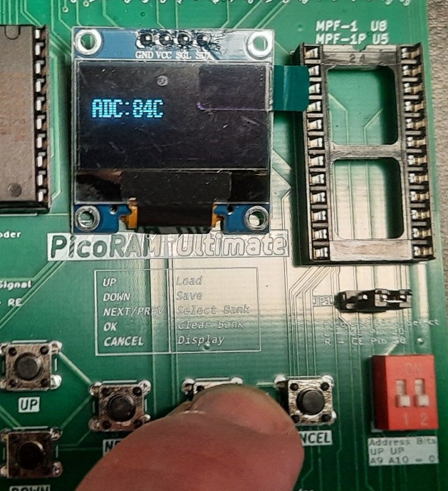

    A threshold value of `0x900` would hence be a good choice for the
`OK` button threshold in the `ULTIMATE.INI` file (4th line).

## Host Machine-Specific Configuration

PicoRAM supports multiple host machines / SBCs. A machine
type-identifier in the first line on the `ULTIMATE.INI` file
determines the machine type.

The following types are supported; each host system is described in
more detail below.

**These are the machine type-identifiers used from firmware version 2.0 on;** more details regarding memory address ranges will be given in the subsequent machine-specific subsections. Please note that
older firmware versions (< 2.0) used different identifiers. 

- `ET3400`: stock Heathkit ET-3400. PicoRAM plugs into the `IC14` and `IC17` 2112 SRAM sockets and provides 256 bytes or 512 bytes of SRAM (configurable via jumper).
- `3400RAM1`: Heathkit ET-3400 with extension header. PicoRAM plugs onto the extension header and provides 2 KBs of SRAM. This requires the additional address decoder (a GAL16V8). 
- `3400RAM2`: Heathkit ET-3400 with extension header. PicoRAM plugs onto the extension header and provides 4 KBs of SRAM. This requires the additional address decoder (a GAL16V8). **This mode is only supported by PicoRAM Rev. 2 hardware.**
- `3400ROM1`: Heathkit ET-3400 with extension header, 2 KB ROM emulation mode. Requires installed SRAMs (2 or 4 2112s), the PROM chip (IC12) pulled, and the address decoder.
- `3400ROM2`: Heathkit ET-3400 with extension header, 4 KB ROM emulation mode. Requires installed SRAMs (2 or 4 2112s), the PROM chip (IC12) pulled, and the address decoder. **This mode is only supported by PicoRAM Rev. 2 hardware.** 
- `ET3400A`: stock Heathkit ET-3400A. PicoRAM plugs into the `U14` and `U15` 2114 SRAM sockets and provides 512 bytes of SRAM.
- `3400ARAM1`: Heathkit ET-3400A with extension header. PicoRAM plugs onto the extension header and provides 2 KBs of SRAM. This requires the additional address decoder (a GAL16V8). 
- `3400ARAM2`: Heathkit ET-3400A with extension header. PicoRAM plugs onto the extension header and provides 4 KBs of SRAM. This requires the additional address decoder (a GAL16V8). **This mode is only supported by PicoRAM Rev. 2 hardware.**
- `3400AROM1`: Heathkit ET-3400A with extension header, 2 KB ROM emulation mode. Requires installed SRAMs (2 or 4 2112s), the PROM chip (IC12) pulled, and the address decoder.
- `3400AROM2`: Heathkit ET-3400A with extension header, 4 KB ROM emulation mode. Requires installed SRAMs (2 or 4 2112s), the PROM chip (IC12) pulled, and the address decoder. **This mode is only supported by PicoRAM Rev. 2 hardware.**
- `LABVOLT`: Lab-Volt 6502 trainer. PicoRAM plugs into the `RAM (D0-D3)` and `RAM (D4-D7)` 2114 sockets and provides 1 KB of SRAM. 
- `MASTERLAB`: Philips MC6400 MasterLab. PicoRAM plugs into the 2 2114 SRAM sockets and provides 1 KB of SRAM. 
- `MPF`: Multitech Microprofessor MPF-1, MPF-1B, MPF-1P. PicoRAM plugs into the `U8` 6116 socket on the MPF-1(B), or the
  `U5` 6116 socket on the MPF-1P and provides 2 KBs of SRAM.

**For machine identifiers used by older firmware versions (< 2.0), please refer to [the old README.](README-v1.md)** 

### Stock Heathkit ET-3400 without Expansion Header

The Heathkit ET-3400 is a Motorola MC6800-based CPU trainer from ~1976
and can be considered one of the very first CPU trainers.

The stock system came with only 2 2112 SRAM chips (`IC14` and `IC15`),
amounting to 256 bytes.  Users could upgrade the machine to 512 bytes
by plugging in two more 2112 SRAMs into `IC16` and `IC17`. PicoRAM
connects to `IC14` and `IC17` and can emulate 512 bytes of memory in the
address range `0x0000 - 0x01ff`.

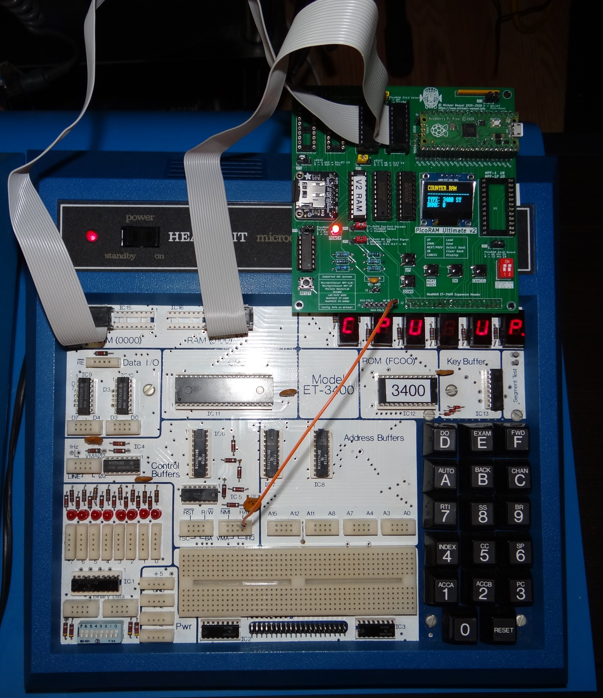

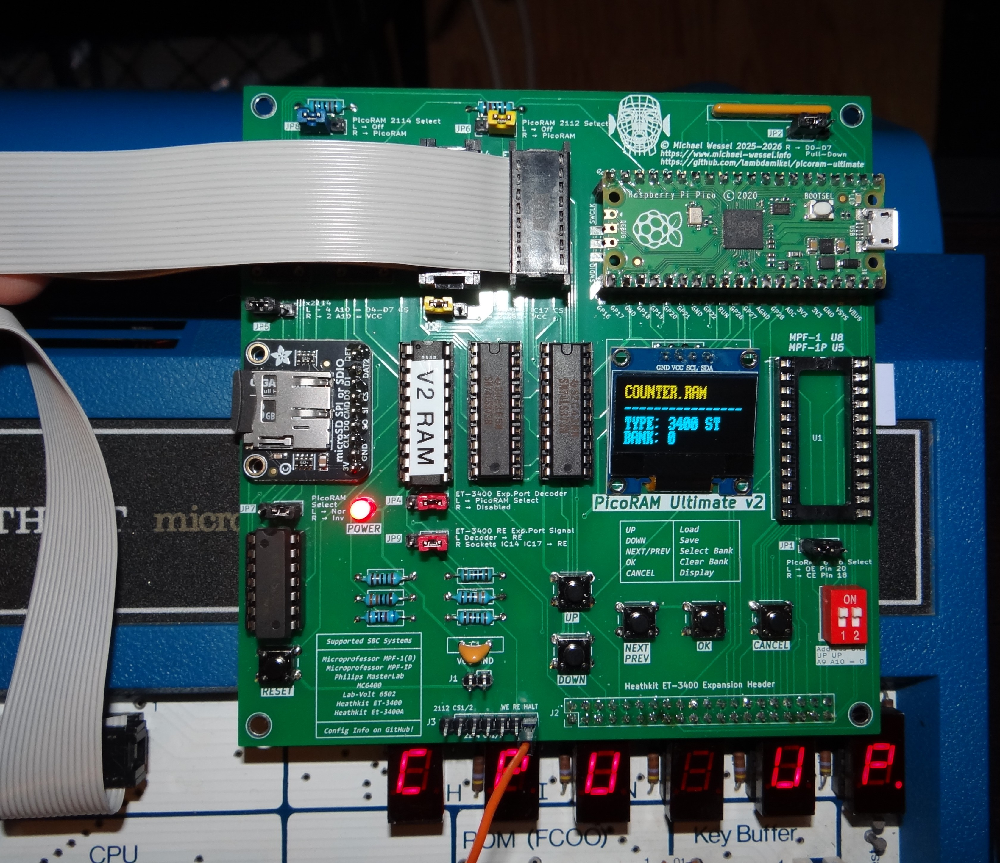

Note that this applies to the ET-3400 with *original MC6800 CPU with
no upgraded crystal*, and that you will need a jumper cable from the
`HALT` pin of PicoRAM's `J3` header to the ET-3400's `HALT` breadboard
connector, as shown in the above picture.

**The machine type string (1st line in the `ULTIMATE.INI`) is
``ET3400``.**

The jumper configuration for this mode is: 

| JP1 | JP2 | JP3 | JP4 | JP5 | JP6 | JP7 | JP8 | JP9 | A9 | A10 | 
|-----|-----|-----|-----|-----|-----|-----|-----|-----|----|-----|
| *   | XR  | N   |  R  | *   | R   | R   | L   | (R) | U  | U   | 

Where `*` = don't care, `XR` = experiment what works best
for your machine, but the default should be `R`, and `N` means:

- L: 4x 2112 (IC14 - IC17), `0x0000` - `0x00FF` and `0x0100` - `0x01ff`, 512 bytes.
- R: 2x 2112 (IC14 - IC15), `0x0000` - `0x00FF`, 256 bytes. 

Note that the GAL is not required in this configuration. 
Hence, `(R)` means that this jumper is 
only required if the GAL is installed.

### Stock Heathkit ET-3400A without Expansion Header

The Heathkit ET-3400A is a Motorola MC6808-based CPU trainer from
~1976, the successor of the ET-3400. It is quite a bit faster than the
ET-3400, uses a 6808 instead of the 6800, and 2 2114 SRAM chips
instead of the 2 (or 4) 2112 SRAM chips in the ET-3400.

The stock system comes with 2 2114 SRAM chips (`U14` and `U15`),
providing 512 Bytes from `0x0000 - 0x01ff`. Interestingly, only 512
Bytes are utilized by the ET-3400A instead of the full 1 KB provided
by the 2 2114, as the Heathkit designers did not connect the 10th
address bit of the CPU (`A9`) to `U14`, `U15` (instead, pin 15 
is simply connected to GND for these chips). 

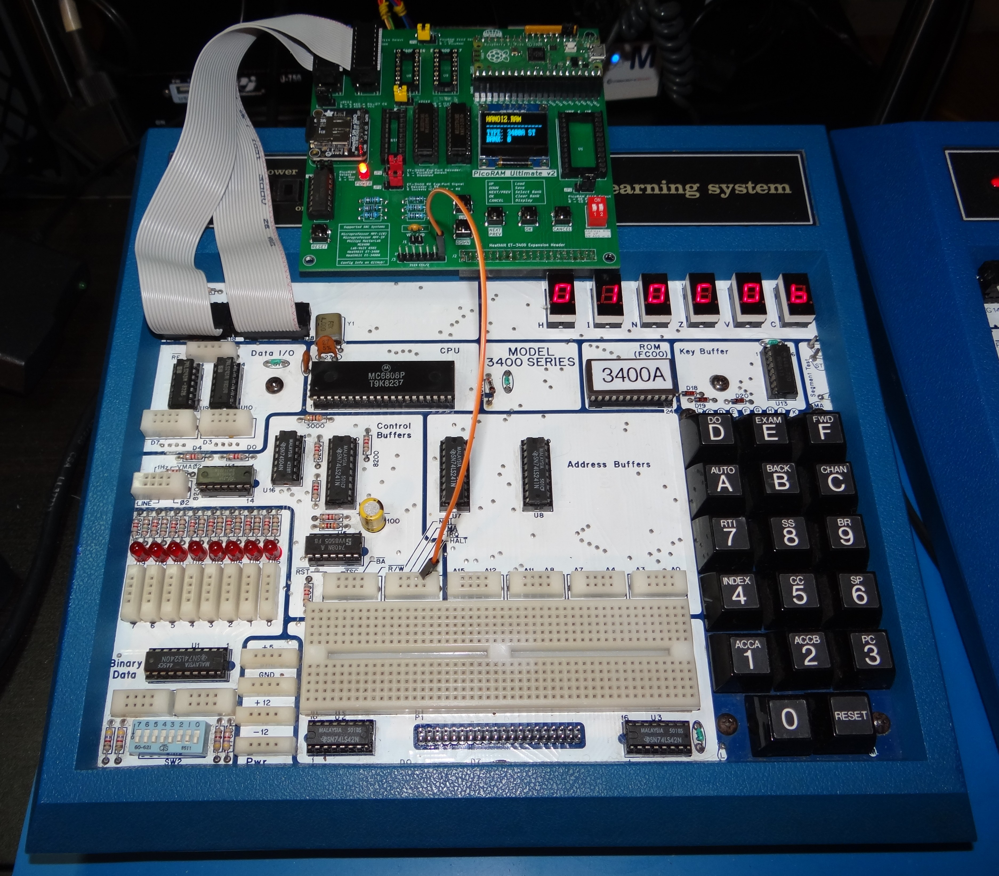

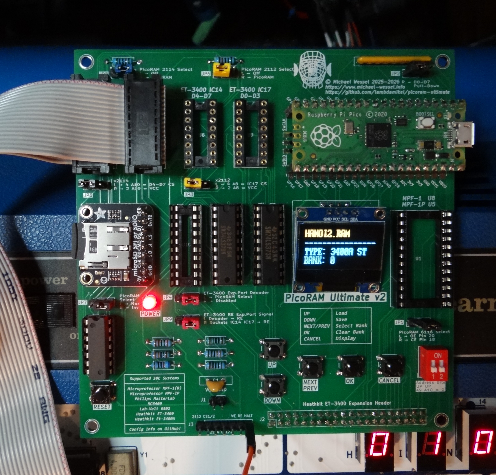

You will also need a jumper cable from the `HALT` pin of PicoRAM's
`J3` header to the ET-3400's `HALT` breadboard connector, as shown in
the above picture.

**The machine type string (1st line in the `ULTIMATE.INI`) is
``ET3400A``.**

The jumper configuration for this mode is: 

| JP1 | JP2 | JP3 | JP4 | JP5 | JP6 | JP7 | JP8 | JP9 | A9 | A10 | 
|-----|-----|-----|-----|-----|-----|-----|-----|-----|----|-----|
| *   | XL  | *   | R   | L   | *   | R   | R   | (R) | D  | D   | 

Where `*` = don't care, and `XL` = experiment what works best
for your machine, but the default should be `L`. 

Note that the GAL is not required in this configuration. 
Hence, `(R)` means that this jumper is 
only required if the GAL is installed.

### Stock Heathkit ET-3400 with Expansion Header

If your ET-3400 has the IO expansion / extension header installed,
then PicoRAM Ultimate can upgrade your machine to 2 KBs or 4 KBs
((PicoRAM Rev. 2 only!) of emulated RAM. It then requires an
additional address decoder, a GAL16V8; this GAL can map the 2 or 4 KBs
(PicoRAM Rev. 2 only) of emulated PicoRAM memory into a user-defined
address range specified by the WinCUPL PLD equation in the GAL
firmware file. The default range for 2 KBs is `0x0000 - 0x07ff`, and
`0x0000 - 0x0fff` for 4 KBs (PicoRAM Rev. 2 only). As this
(intentionally) overlaps with the installed SRAM chips, these SRAM
chips need to be pulled in this RAM emulation mode.

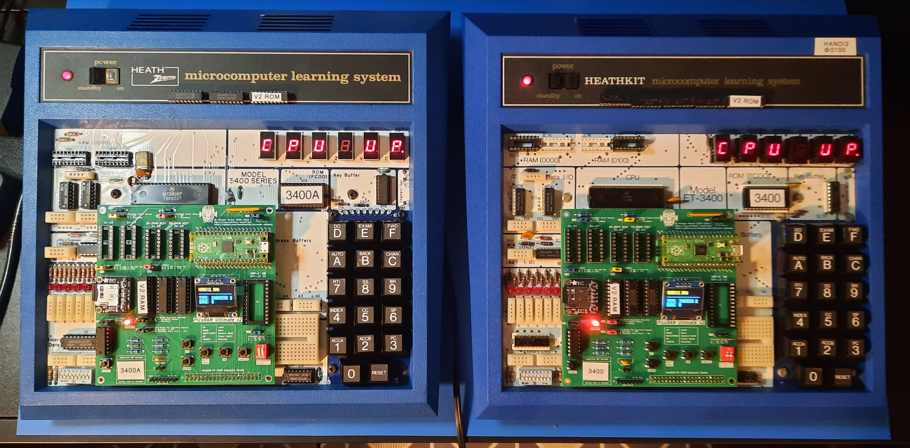

However, if PicoRAM RAM is mapped into a different region, e.g.,
starting from address `0x1000` or `0x2000`, then PicoRAM memory can
coexist in conjunction with the installed SRAM chips. Some users will
prefer this, as it maximizes the amount of RAM available to the
system, but the machine code demonstratation programs from the
Heathkit ET-3400 manual would need to be changed / relocated where
applicable (i.e., any absolute addresses used in these programs).

It is also possible to emulate ROM memory with PicoRAM. ROM memory
would be protected from programmatic or monitor-based
modifications. In ROM emulation mode, the installed monitor (P|EP)ROM
(IC12) can be removed and emulated by PicoRAM. This allows you to
replace, modify, or extent the built-in monitor program, without
having to reprogramm (E)EPROMS. The monitor ROM is 1 KB only and
starts at address `0xfc00`; PicoRAM can either emulate 2 KBs of ROM
starting from address `0xf800`, or 4 KBs of ROM (PicoRAM Rev. 2 only),
starting from address `0xf000`. Note that the machine will not run with
RAM, so you will still need the original (SR)RAM chips installed then.

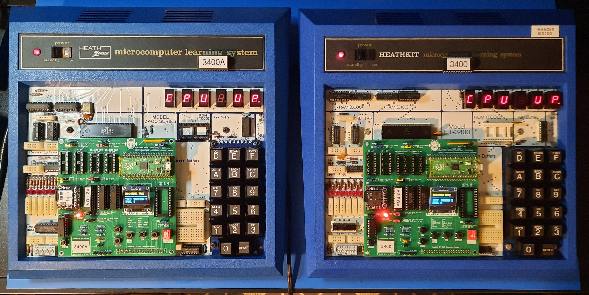

Note that this applies to the ET-3400 with *original stock MC6800 CPU
with no upgraded crystal with an installed (and fully wired-up)
expansion header.*

The machine type string (1st line in the `ULTIMATE.INI`) is
- ``3400RAM1`` for 2 KBs of RAM in a user-defined range, depending on the address decoder JED file used. For the default range  `0x0000` - `0x07ff`, use [this decoder](src/et3400_decoder_0x0000/rev1) for PicoRAM Ultimate Rev. 1, and
[this decoder](src/et3400_decoder_0x0000/rev2) for PicoRAM Ultimate Rev. 2. Remove all 2112 SRAM chips for this address range.
- ``3400RAM2`` for 4 KBs of RAM (PicoRAM Rev. 2 only) in a user-defined range, depending on the address decoder JED file used. For the default range  `0x0000` - `0x0fff`, use [this decoder](src/et3400_decoder_0x0000/rev2) for PicoRAM Ultimate Rev. 2. Remove all 2112 SRAM chips for this address range.
- ``3400ROM1`` for 2 KBs of ROM in a user-defined range, depending on the address decoder JED file used. For the default range  `0xf800` - `0xffff`, use [this decoder](src/et3400_decoder_0xf800/rev1) for PicoRAM Ultimate Rev. 1, and
[this decoder](src/et3400_decoder_0xf800/rev2) for PicoRAM Ultimate Rev. 2. Remove the (P|EP)ROM chip IC12 for this address range.
- ``3400ROM2`` for 4 KBs of ROM (PicoRAM Rev. 2 only) in a user-defined range, depending on the address decoder JED file used. For the default range  `0xf000` - `0xffff`, use [this decoder](src/et3400_decoder_0xf000/rev2) for PicoRAM Ultimate Rev. 2.  Remove the (P|EP)ROM chip IC12 for this address range. 

PicoRAM plugs onto the expansion header as follows: 

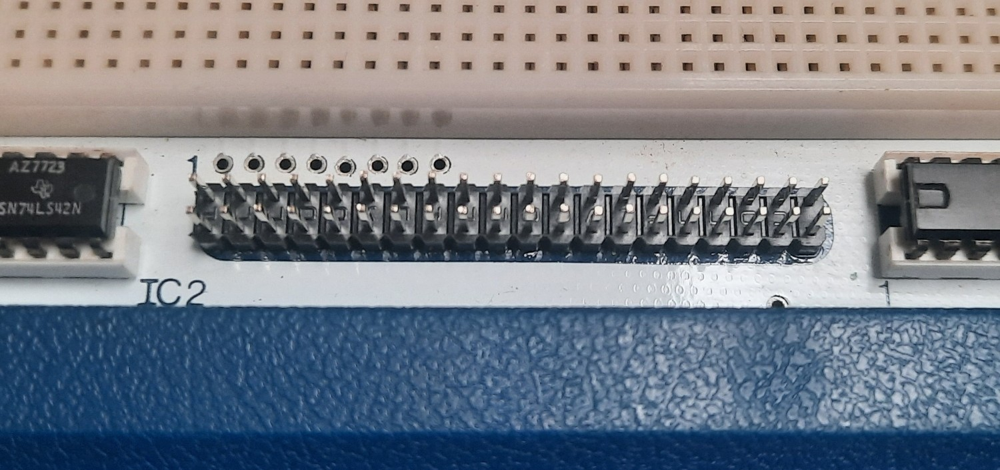

In particular, it is assumed that the databus wires have been soldered
in (by default, the PCB only accommodates for the address bus and the
control signals!), as well as the `RE` signal:

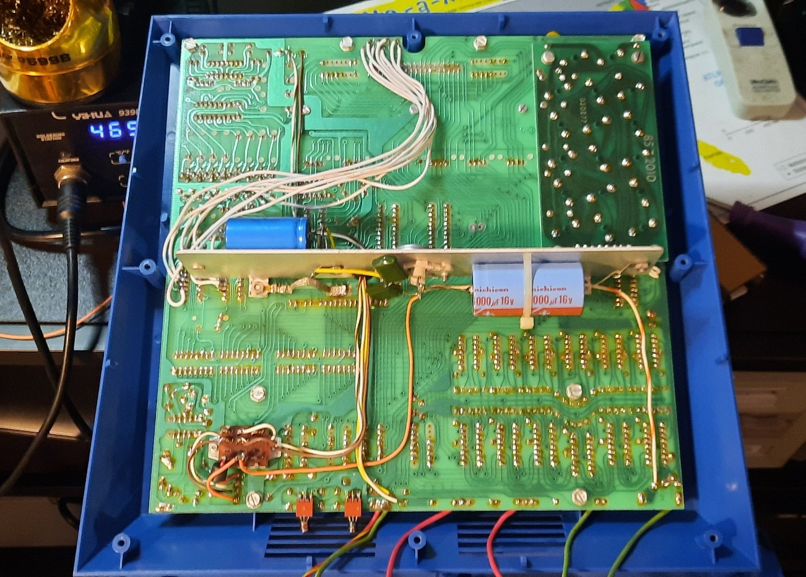

The databus and `RE` signal mods are also described in the 
[IO extension box manual](docs/e34modkt.pdf). 

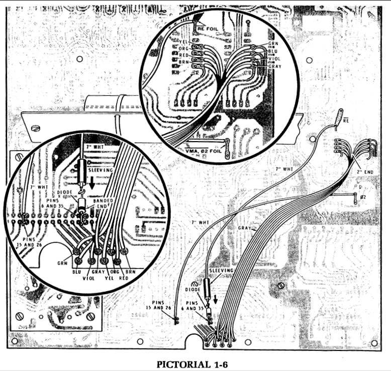

If you require a custom memory range, you can easily change the
`RAM_SELECT` equation in the GAL PLD file and recompile with WinCUPL,
yielding a new [JED file] for the GAL programmer.

For example, we can change the default [PicoRAM Rev. 1
decoder](src/et3400_decoder_0x0000/rev1/etgal.PLD) to map into the
memory region starting at address `0x1000` so that it won't overlap
with the installed SRAM chips - all we have to do is change the line

`RAM_SELECT = ! A12 & ! A13 & ! A14 & ! A15 ;`

to 

`RAM_SELECT = A12 & ! A13 & ! A14 & ! A15 ;`

[yielding this PLD file:](src/et3400_decoder_0x1000/rev1/etgal.PLD)

```
PIN  1 = A9 ; 
PIN  2 = A10 ; 
PIN  3 = A11 ; 
PIN  4 = A12 ; 
PIN  5 = A13 ; 
PIN  6 = A14 ; 
PIN  7 = A15 ;

PIN  9  = CS1A8 ; 
PIN  11 = CS2A8 ; 

PIN 19 = WR ; 
PIN 18 = VMA ;

PIN 15 = RE ; 

PIN 12 = SE ; 

RAM_SELECT = A12 & ! A13 & ! A14 & ! A15 ;

ACCESS = ! VMA & RAM_SELECT ; 

RE = ! ( ACCESS & WR ) ;
SE = ACCESS ; 
```

Note that the [PicoRAM Rev. 2
decoder](src/et3400_decoder_0x0000/rev2/etgal.PLD) is different from
the Rev. 1 decoder, as it allows more fine grained start addresses for
the memory pages - whereas the Rev. 1 decoder can only decode based on
the address line inputs `A9` to `A15` (hence, in 2 KB granularity),
the Rev. 2 decoder "sees" `A6` to `A15` (hence, in 128 bytes
granularity). Consequently, the `RAM_SELECT` equation in the Rev. 2
decoder files *can* have more terms if required.

There is [some software for the RAM and ROM configurations; in particular,
a 2 KB and 4 KB monitor ROM.](software/et-3400/). The
[2 KB monitor ROM](software/et-3400/rev1/rom-2kb-f800/) also contains
the Towers of Hanoi starting at `0xf800`; the monitor itself starts at
`0xfc00`. The [4 KB monitor ROM](software/et-3400/rev2/rom-4kb-f000/)
(can only be used with PicoRAM Rev. 2) contains the clock at address
`0xf000` in addition. 

Again, note that the ROM memory is write-protected; hence, you cannot
change it with the monitor or programmatically. Use the standard RAM
(`0x0000 - 0x01ff`) for writeable memory in the `3400ROM1` and
`3400ROM2` configurations. Of course, as demonstrated with the
ROM-included clock and Hanoi programs, it is possible to have your own
programs in addition to the monitor. Also note that it
is not possible to run the monitor program without (at least some)
RAM.


The jumper settings are as follows: 

| JP1 | JP2 | JP3 | JP4 | JP5 | JP6 | JP7 | JP8 | JP9 | A9 | A10 | 
|-----|-----|-----|-----|-----|-----|-----|-----|-----|----|-----|
| *   | R   | *   | L   | *   | L   | R   | L   | L   | D  | D   |


### Stock Heathkit ET-3400A with Expansion Header

For the ET-3400A, the same description applies (and see the ET-3400A in the above pictures), but the machine identifiers
are different - note that the GAL decoders are identical to the ET-3400 versions as well:  

The machine type string (1st line in the `ULTIMATE.INI`) is
- ``3400ARAM1`` for 2 KBs of RAM in a user-defined range, depending on the address decoder JED file used. For the default range  `0x0000` - `0x07ff`, use [this decoder](src/et3400_decoder_0x0000/rev1) for PicoRAM Ultimate Rev. 1, and
[this decoder](src/et3400_decoder_0x0000/rev2) for PicoRAM Ultimate Rev. 2. Remove all 2112 SRAM chips for this address range.
- ``3400ARAM2`` for 4 KBs of RAM (PicoRAM Rev. 2 only) in a user-defined range, depending on the address decoder JED file used. For the default range  `0x0000` - `0x0fff`, use [this decoder](src/et3400_decoder_0x0000/rev2) for PicoRAM Ultimate Rev. 2. Remove all 2112 SRAM chips for this address range.
- ``3400AROM1`` for 2 KBs of ROM in a user-defined range, depending on the address decoder JED file used. For the default range  `0xf800` - `0xffff`, use [this decoder](src/et3400_decoder_0xf800/rev1) for PicoRAM Ultimate Rev. 1, and
[this decoder](src/et3400_decoder_0xf800/rev2) for PicoRAM Ultimate Rev. 2. Remove the (P|EP)ROM chip IC12 for this address range.
- ``3400AROM2`` for 4 KBs of ROM (PicoRAM Rev. 2 only) in a user-defined range, depending on the address decoder JED file used. For the default range  `0xf000` - `0xffff`, use [this decoder](src/et3400_decoder_0xf000/rev2) for PicoRAM Ultimate Rev. 2.  Remove the (P|EP)ROM chip IC12 for this address range. 

There is [some software for the RAM and ROM configurations; in
particular, a 2 KB and 4 KB monitor ROM.](software/et-3400a/). The [2
KB monitor ROM](software/et-3400a/rev1/rom-2kb-f800/) also contains
the Towers of Hanoi starting at `0xf800`; the monitor itself starts at
`0xfc00`. The [4 KB monitor ROM](software/et-3400a/rev2/rom-4kb-f000/)
(can only be used with PicoRAM Rev. 2) contains the clock at address
`0xf000` in addition. Note that most programs are identical to the
ET-3400 versions; only the clock program is different to accomodate
the faster CPU clock.

The same configuration as for the ET-3400 with expansion header
applies: 


| JP1 | JP2 | JP3 | JP4 | JP5 | JP6 | JP7 | JP8 | JP9 | A9 | A10 | 
|-----|-----|-----|-----|-----|-----|-----|-----|-----|----|-----|
| *   | R   | *   | L   | *   | L   | R   | L   | L   | D  | D   |


### Lab-Volt 6502 

The Lab-Volt 6502-based CPU trainer was released by **FESTO Didactic**
in the early 1980s; apparently, the machine was being manufactured at
least until 1999 - my accompanying textbook copy is the "16th
printing, 1999". The trainer is equipped with 2 2114 SRAM chips (1 KB
of RAM):

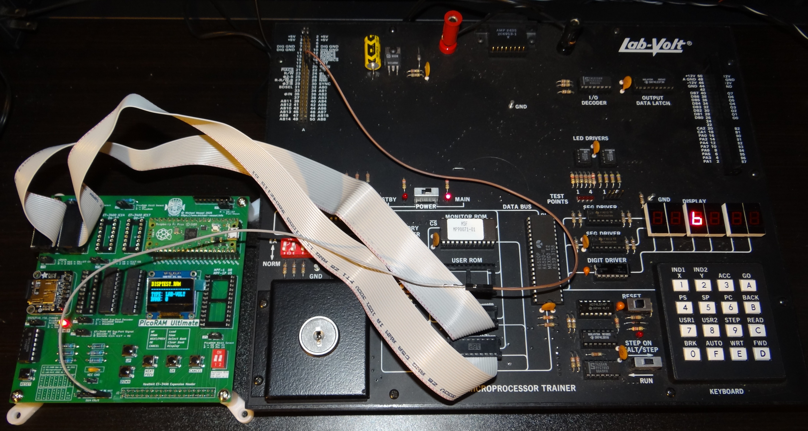

The machine type string (1st line in the `ULTIMATE.INI`) is
``LABVOLT``. 

The jumper settings are as follows: 

| JP1 | JP2 | JP3 | JP4 | JP5 | JP6 | JP7 | JP8 | JP9 | A9 | A10 | 
|-----|-----|-----|-----|-----|-----|-----|-----|-----|----|-----|
| *   | R   | *   | R   | N   | L   | R   | R   | *   | D  | D   | 

Where `*` = don't care and for `N`: 

- R: 2x 2114, `0x0000` - `0x03FF`, 1 KB  

Moreover, the `JP5` setting for 2 KBs 

- L: 4x 2114, `0x0000` - `0x07FF`

**does not work for the Lab-Volt** - but might work for a different
host machine with 4 2114 chips. Check [the schematics.](pics/schematics.png)

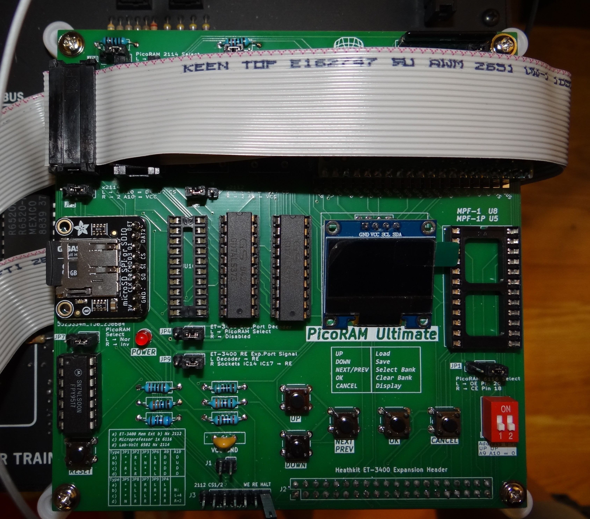

A jumper wire must be routed from the `HALT` pin on `J3` to `RDY (22)` 
pin on the machine's system bus header (top-left header).

### Philips MasterLab MC6400 

The Philips MasterLab MC6400 is a INS8070 (SC/MP III)-based CPU
trainer released in ~1984. Despite the Philips label, the machine was
only released in Germany, and likely developed in my birth town,
Hamburg / Germany. More infos can be found
[here](https://www.classic-computing.de/wp-content/uploads/2024/10/load10web.pdf). It
is equipped with 2 2114 SRAM chips (1 KB of RAM):

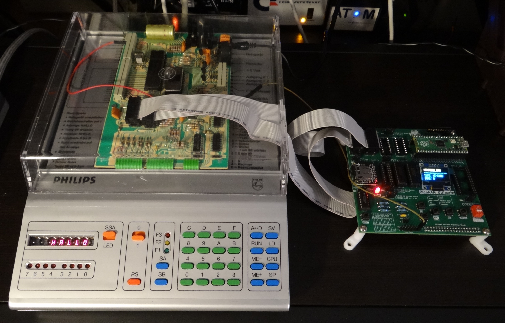

You will have to modify your MC6400 and put in sockets to accommodate
PicoRAM as follows. The PCB is of very good quality, and with a little
bit of soldering skills you will have no issues accomplishing this:

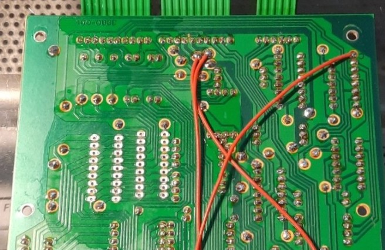

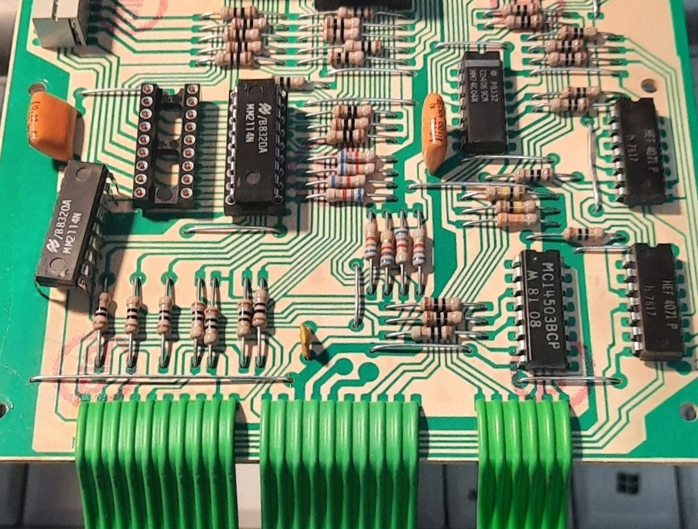

The machine type string (1st line in the `ULTIMATE.INI`) is
`MASTERLAB``. 

The jumper settings are as follows: 

| JP1 | JP2 | JP3 | JP4 | JP5 | JP6 | JP7 | JP8 | JP9 | A9 | A10 | 
|-----|-----|-----|-----|-----|-----|-----|-----|-----|----|-----|
| *   | R   | *   | R   | N   | L   | R   | R   | *   | D  | D   | 

Where `*` = don't care and for `N` - emulate

- R: 2x 2114, `0x1000` - `0x13FF`, 1 KB (note that the RAM starts at
  address `0x1000` on the MC6400).

Moreover, the `JP5` setting for 2 KBs 

- L: 4x 2114, `0x0000` - `0x07FF` 

**does not work for the MasterLab** - but might work for a different
host machine with 4 2114 chips. Check [the schematics.](pics/schematics.png)

Note that a jumper wire is required that connects the `HALT` pin of
the `J3` header to the MasterLab's `Master Reset` as follows - this is
the first top-most connector socket that is not occupied by a wire
bridge:

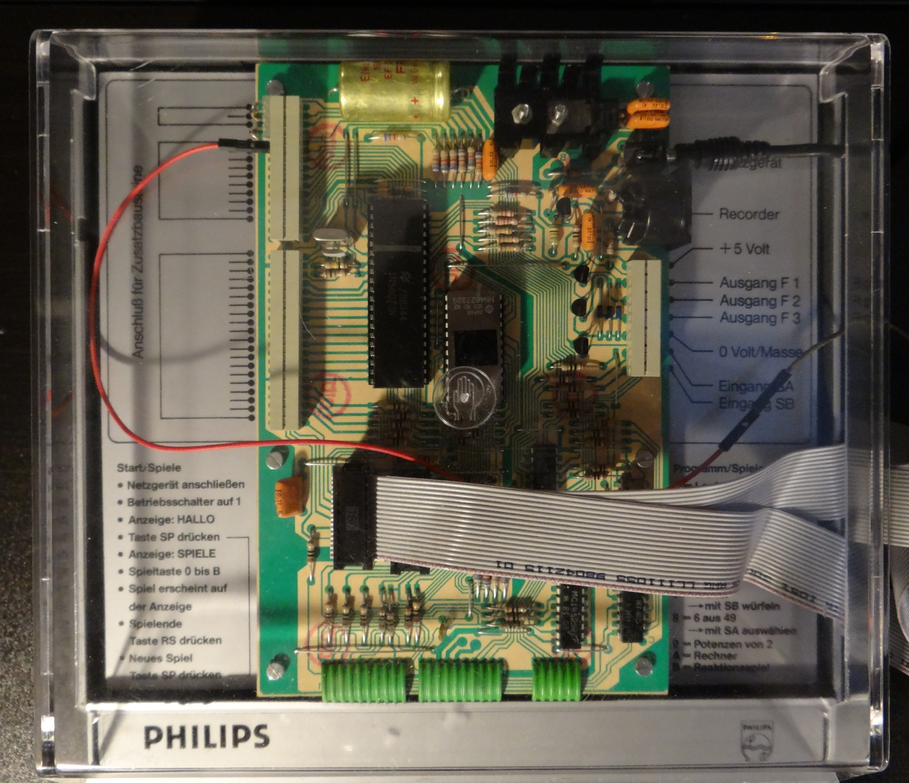

It can be seen more clearly in this pinout diagram:

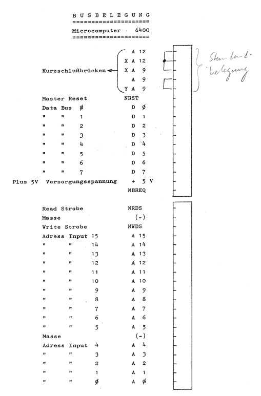

### Multitech Microprofessor MPF-1 

The company Multitech (nowadays: Acer) released a series of Z80-based
trainers as early as 1981 (MPF-1); later models included a Palo Alto
TinyBASIC EPROM (MPF-1B), and the much more powerful and capable
MPF-1P (One Plus) that featured an alphanumeric keyboard and VFD, had
a symbolic 2pass assembler with line editor, a full floating point
BASIC, and Forth! More info about these fascinating machines can be
found
[here.](https://hackaday.io/project/183618-exploring-the-microprofessor)

The machine type string (1st line in the `ULTIMATE.INI`) is
``MPF``. PicoRAM emulates one 6116 chip and supplies 2 KBs of SRAM. 

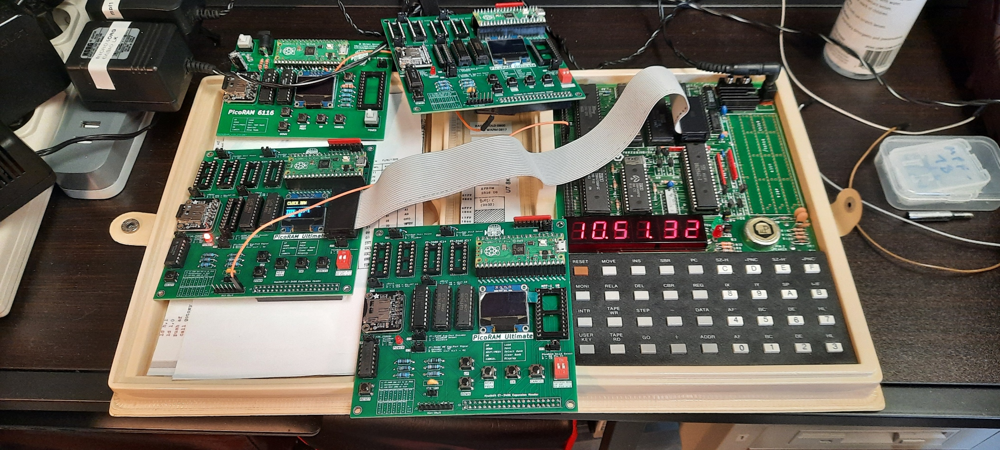

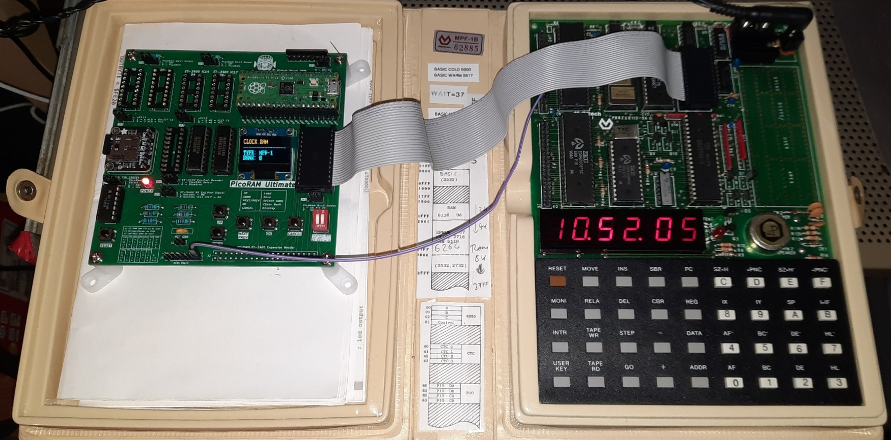

The jumper settings are: 

| JP1 | JP2 | JP3 | JP4 | JP5 | JP6 | JP7 | JP8 | JP9 | A9 | A10 | 
|-----|-----|-----|-----|-----|-----|-----|-----|-----|----|-----|
| R   | L   | *   | R   | *   | L   | L   | L   | *   | D  | D   |

On the MPF-1(B), PicoRAM should be plugged into the `U8` 6116 socket.
For the MPF-1P, the `U5` 6116 socket should be used.

For `U8` on the MPF-1(B), the 2 KBs of RAM *usually* appear in the
address range `0x1800 - 0x1FFF`. On the MPF-1P, `U6` is mapped to
`0xf800 - 0xFFFF`.

The `HALT` pin of the `J3` header needs to be connected to **pin 37**
on the MPF's (1, 1B, 1P) primary (top-left) extension header via a
jumper wire.  Double check `JP1` as well; for the Microprofessor, it
needs to be set to R (for `CE`, pin 18).

I also recommend to add an additional decoupling capacitor (104, 0.1
uF / 100 nF) between GND and VCC of the 6116 socket to help with
noise:

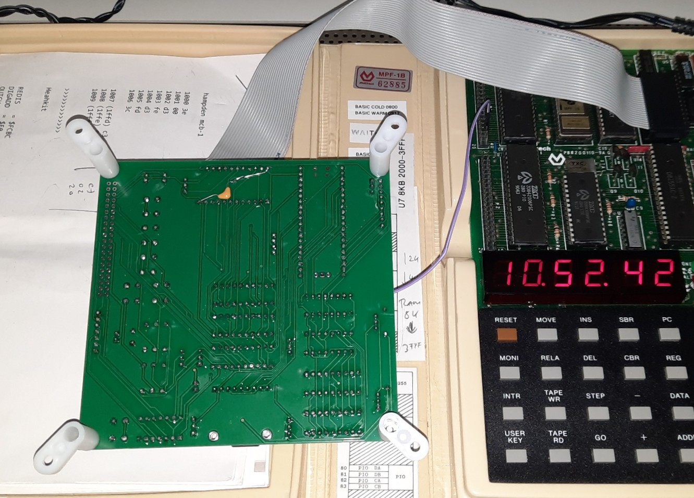

**If you encounter stability problems, try removing the 10k resistor
array completely.**

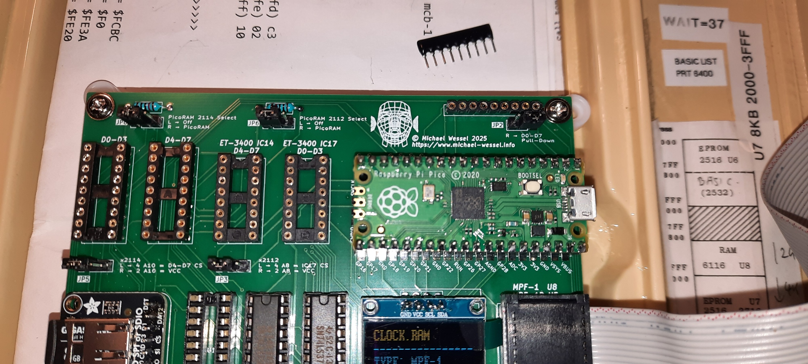


Also have a look at [the predecessor project, PicoRAM 6116.](https://github.com/lambdamikel/picoram6116)

## Host Machine-Specific Software and Example `ULTIMATE.INI` Initialization Files 

PicoRAM uses a FAT32-formatted (max 32 GB) Micro SD Card.

To get started, you can simply copy the sub-directory for the intended
host machine from [the software/ directory.](software/)


## Theory of Operation

The Raspberry Pi Pico emulates the SRAM of the host machine and is
overclocked to 250 MHz to make this possible; this is completely in
the safe range and does not affect the longevity of the RP2040 in any
negative way.

Due to a lack of GPIOs on the Pico, two 74LS373 (or 74F373)
transparent octal latches are used to multiplex the (max) 12-bit
address bus. The (up to) 12-bit address is read in two batches of 6
bits, using the `SEL1` and `SEL2` signals from the Pico to `OE` 
(Output Enable) the first resp. second latch. The latches are merely
used for their tri-state capabilities.

Unlike my previous design, [PicoRAM
2090](https://github.com/lambdamikel/picoram2090), this design does
not utilize any voltage level converters. It turns out that the Pico
(RP2040) is really pretty much 5V-tolerant; also see [this article
from
Hackaday](https://hackaday.com/2023/04/05/rp2040-and-5v-logic-best-friends-this-fx9000p-confirms/)
and the [Hackaday coverage of PicoRAM
2090.](https://hackaday.com/2023/09/10/pi-pico-becomes-sram-for-1981-educational-computer/)

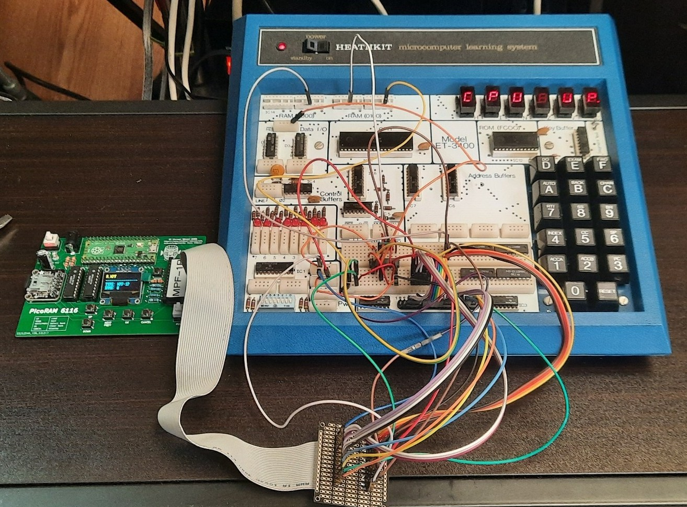
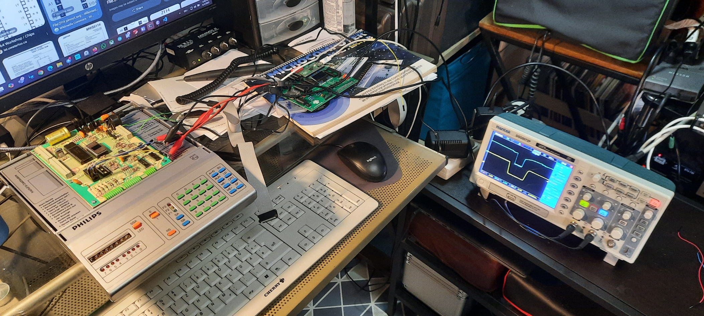
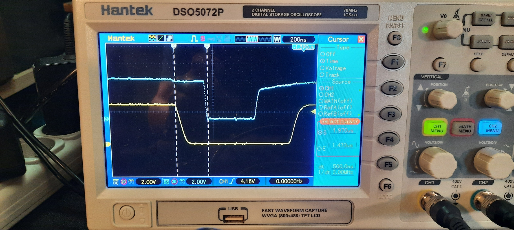
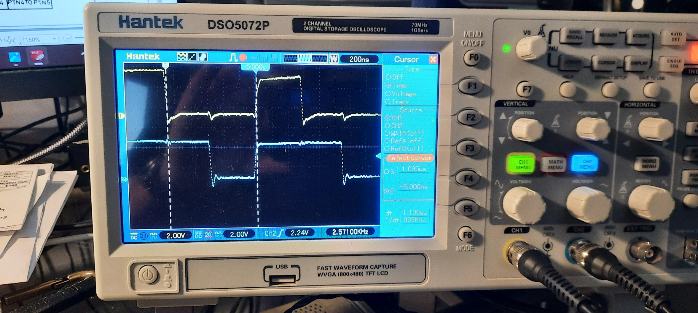

More details about the making of the project, and technical notes /
development logs can be found on the [PicoRAM 6116 Hackaday project
page](https://hackaday.io/project/194092-picoram-6116-sram-emulator-sd-card-interface)
and the [PicoRAM Ultimate Hackaday project
page.](https://hackaday.io/project/203133-picoram-ultimate)

## The Board 

### Schematics


Here is [a PDF of the schematics.](pics/schematics-rev2.pdf)

### Printed Circuit Board (PCB)

The current version is Rev. 2, January 2026.

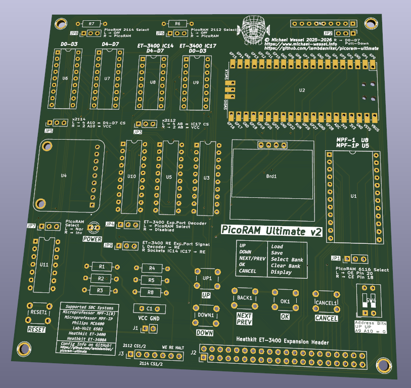

There is also a [Bill of Material (BOM).](gerbers/BOM.csv)

**Note that the resistor array should be 10K (code: 103).** The 2112,
2114, 6116 chips are only sockets, obviously (so you don't actually
need to purchase any SRAM chips - PicoRAM emulates them).

### Gerbers 

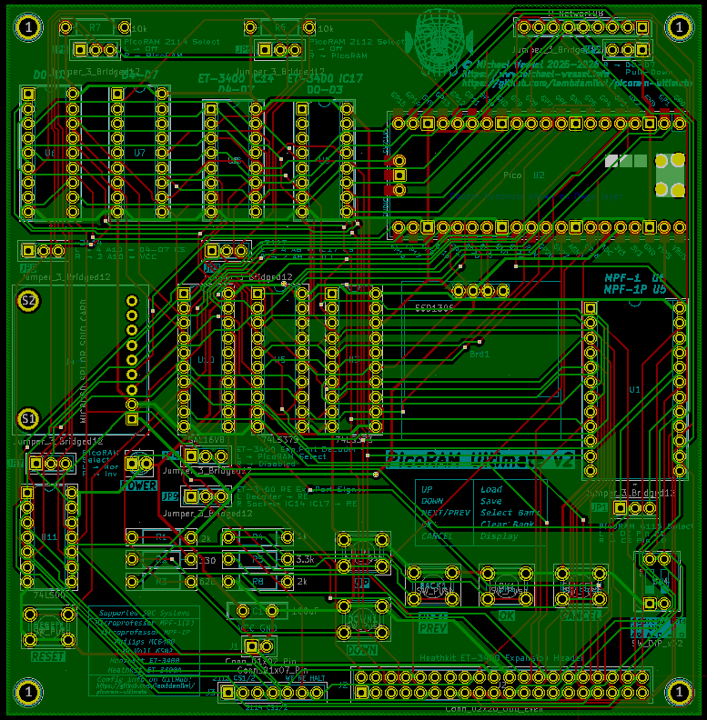

See [here.](gerbers/v2/gerbers-v2.zip) 

## Firmware Image

The current version is 2.0, January 27th 2026. The `.uf2` image can be
found [here.](firmware/rev1+2/picoram_ultimate_v2.0.uf2)

## Firmware Sources

See [here.](src/picoram_ultimate/picoram_ultimate.c) 

## Acknowledgements

- Harry Fairhead for his [excellent
  book!](https://www.amazon.com/gp/product/1871962056)

- The authors of the libraries that I am using:

  - Carl J Kugler III carlk3:
    [https://github.com/carlk3/no-OS-FatFS-SD-SPI-RPi-Pico](https://github.com/carlk3/no-OS-FatFS-SD-SPI-RPi-Pico)

  - Raspberry Pi Foundation for the `ssd1306_i2c.c` demo.

